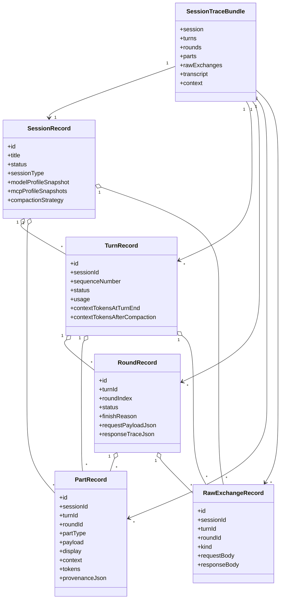
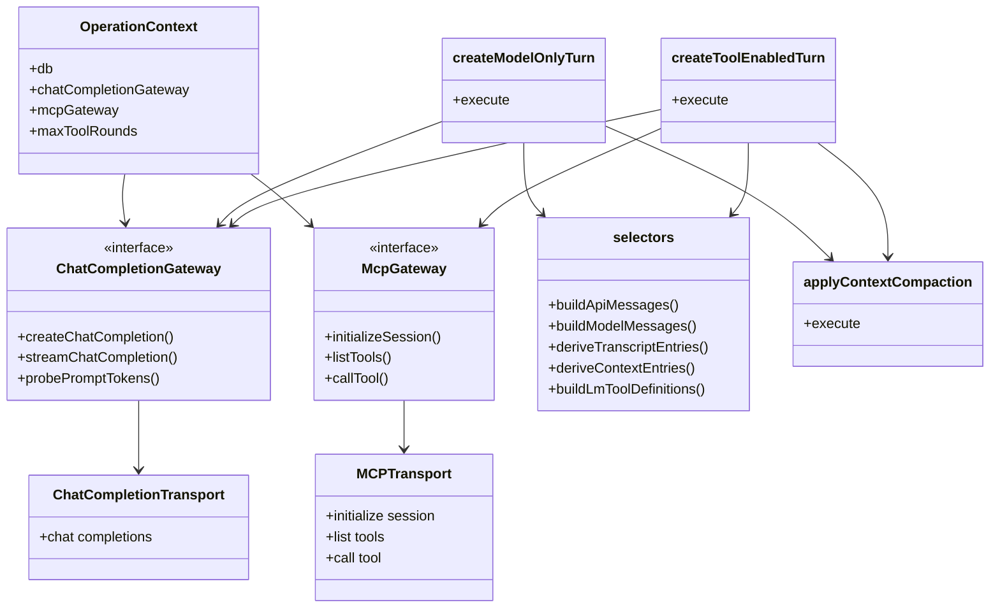

# Architecture

## Purpose and product position

This project is a **backend-centered runtime and diagnostics tool**, not a generic chat UI. It is built for:

- developing and debugging MCP server workflows
- studying multi-turn LLM behavior
- inspecting reasoning, tool choice, and context growth
- exporting runs that can be replayed as deterministic regressions

The value of the project depends on correctness and inspectability:

- token accounting must attach to canonical runtime state
- reasoning history must be preserved for study
- context trimming rules must be explicit and testable
- raw LM/MCP exchanges must be retained for replay and debugging

## Documentation boundaries

- [DATA-MODEL.md](DATA-MODEL.md) — compact canonical runtime tree, public part taxonomy, canonical IDs, and lookup-model rules
- [backlog/completed/SESSION-ANALYSIS.md](backlog/completed/SESSION-ANALYSIS.md) — shipped `session_analysis` workflow and evidence-loading rules
- [DATABASE-SCHEMA.md](DATABASE-SCHEMA.md) — current SQLite tables, foreign keys, singleton defaults, and ER diagram
- [CLI.md](CLI.md) — CLI command reference: commands, flags, output format, exit codes
- `ARCHITECTURE.md` — system design, persistence model, streaming model, replay model, and API overview

## Tech stack

**Backend:** Fastify + TypeScript, SQLite (better-sqlite3), OpenAI-compatible HTTP/SSE client (shared across LM Studio, OpenRouter, and Ollama), MCP HTTP client

**Frontend:** Svelte 5 + TypeScript + Vite — thin UI layer over backend-owned state, lives under `frontend/`

## Core architectural principles

- the backend owns the canonical runtime state
- SQLite is the canonical persistent store
- every mcpscope session remains an LLM session, even when deterministic steps steer it
- transcript and context are two views over the same runtime, not separate systems
- exported traces must stay replayable without reconstruction
- the frontend is a thin client over backend state
- command/tool interfaces are thin adapters over a backend-owned canonical operation catalog
- the MCP interface executes operations directly via the backend (no loopback HTTP)
- raw exchanges are preserved for diagnostics, auditing, and replay

## Product surfaces and contract sharing

mcpscope currently ships:

- a Web UI for human inspection and configuration
- a backend HTTP API as the canonical integration layer
- a packaged CLI for shell-native workflows
- an MCP interface for agent-native interaction (Streamable HTTP at `/mcp`)

These surfaces stay aligned around one backend-owned model and one backend-owned set of semantics.

### Backend-owned operation catalog

The shared CLI/MCP operation catalog lives in `backend/src/operations/catalog.ts` and is re-exported through `backend/src/operations/index.ts`. Each shared operation in that catalog defines, in one place:

- canonical operation ID
- user-facing description (used by both CLI help and MCP tool descriptions)
- input schema (Zod — canonical contract used by backend execution and MCP tool registration)
- output schema (Zod shape — used by MCP for structured output)
- execution function (calls backend directly — no loopback HTTP)
- machine-readable success shape (snake_case throughout)
- machine-readable error shape

The CLI and MCP interface are adapters over this backend-owned catalog:

- **CLI** — a thin remote adapter: argv parsing, stdin handling, text rendering, exit codes, and HTTP calls to the backend API
- **MCP** — a backend-native adapter: tool registration from the catalog, direct execution via `OperationContext`, structured output via `outputSchema` + `structuredContent`

Important rules:

- the backend owns operation semantics and execution
- the MCP interface does not call the backend API over loopback HTTP for shared operations
- the CLI calls the backend over HTTP (it is a remote adapter by design)
- machine-readable command semantics are defined once in `backend/src/operations/catalog.ts` (the single source of truth)
- presentation differences (text rendering, exit codes, MCP content formatting) are adapter concerns; semantic drift is not
- every new shared operation should be added once to `backend/src/operations/catalog.ts` and then exposed automatically through both adapters

Backend-only HTTP operations may live alongside the shared ones under `backend/src/operations/`, but they are not part of the shared catalog unless they are added to `catalog.ts`.

## Runtime state and persistence

The canonical runtime model is defined in [DATA-MODEL.md](DATA-MODEL.md).

The backend persistence layer is organized around the execution model:

- `SessionContainer` — the domain-level ownership abstraction (see `backend/src/domain/executionModel.ts`)
- `Session` — the execution container; also a `SessionContainer`
- `Step` — the abstract execution unit (see `backend/src/domain/executionModel.ts`)
- `WorkflowStep` — the abstract deterministic step subtype implemented by concrete analysis step classes in `analysis/shared/` and `analysis/fastTool/` (see `backend/src/workflow/workflowStep.ts`); may own zero or more `Turn` children
- `Turn` — the LLM-specific step subtype; owns `Round`, `Part`, and `RawExchange` records

The persistence-layer record types (`SessionRecord`, `TurnRecord`, `RoundRecord`, `PartRecord`, `RawExchangeRecord`) remain the authoritative source for runtime behavior and replay. They persist to the canonical v2 schema. For the record-to-table mapping and column-level details see [DATABASE-SCHEMA.md](DATABASE-SCHEMA.md).

Normal startup initializes that runtime schema plus the shared config/default tables only. The legacy `sessions` / `turns` / `rounds` / `parts` / `raw_exchanges` tables remain available only through the explicit legacy initializer used by old-schema validation tests; they are not part of the normal runtime path.

### Current implementation

Today, mcpscope persists and exposes sessions as execution containers running on top of the canonical execution model:

- `Session.execute()` runs the execution loop by calling `advance()` while `canContinue()` is true
- `Session.advance()` executes the next `Step`
- `Step.execute(context)` runs the unit of work, delegating to `createModelOnlyTurn` / `createToolEnabledTurn`

The important distinction is architectural rather than cosmetic:

- determinism does not require moving workflow state outside the session model
- a session can remain the visible, canonical LLM session while deterministic steps steer what the
	next bounded turn sees and does
- the analysis workflow is the shipped proof of that model

The shipped product implements:

- `Session` and `Step` / `Turn` execution model with explicit loop boundaries
- a `WorkflowStep` abstract class with template-method lifecycle (`execute()` → `run(ctx)`) and five concrete analysis step subclasses (bootstrap, tool-call assessment, turn summary, final aggregation, grouped assessment)
- a backend-owned sequential execution scheduler with one active slot, one in-memory queue, and one global execution event stream
- `SessionContainer` ownership: sessions may belong to a parent session or a `Benchmark` container
- `Benchmark` as a minimal `SessionContainer` for grouping sessions (full benchmark domain design is future work)
- generic container/session/step persistence without table-per-subtype growth
- a registry-based analysis workflow factory (`registerAnalysisWorkflow()` / Map lookup) replacing `switch(workflowKind)`
- self-contained analysis subclasses (`fullSession/`, `fastSession/`, `fastTool/`) each owning its own prompt builders, schema keys, Zod schemas, and system prompt
- zero analysis-type knowledge in shared step classes — all behavior injected via constructor functions
- constrained one-level workflow-step-owned-turn grouping for workflow-oriented traces

What is **not** implemented yet:

- full benchmark product work beyond minimal container support
- public generic step enqueue across all adapters and client helpers
- broader workflow automation and cleanup beyond the shipped analysis-session workflow

### Execution control plane

All executable work runs through a single backend scheduler. The canonical flow is:

```
trigger (HTTP / CLI / MCP)
  → enqueue (scheduler.enqueueSession / enqueueInit / enqueueStep)
  → scheduler execution (one sequential worker, one active job at a time)
  → scheduler events (SSE on /api/scheduler/stream)
  → view state (frontend executionStore + sessionStore derived stores)
```

Scheduler characteristics:

- one sequential worker and one in-memory queue
- one active job at a time across all sessions
- global snapshot plus global scheduler SSE stream for UI/CLI/MCP-facing monitoring
- pausing is boundary-based: the scheduler stops after the current running step or turn finishes, then leaves the remaining session state resumable from persisted runtime records

Job kinds:
- `init` — session initialization (prelude token probing, MCP setup); auto-enqueued when a primary session is created
- `session` — primary turn execution or analysis session execution
- `step` — single analysis step execution (for debug step-through)

The scheduler is the only execution owner. No route or operation directly runs a model turn, analysis step, or initialization outside the scheduler in normal runtime flow.

### Backend module map

The backend structure is intentionally split so architectural seams are visible in code, not just in docs:

- `backend/src/app.ts` bootstraps Fastify, opens the database, wires shared helpers, and registers route groups
- `backend/src/routes/` groups HTTP routes by concern:
	- `systemRoutes.ts` for health/runtime/meta
	- `sessionRoutes.ts` for session creation, listing, status, and analysis launch
	- `configurationRoutes.ts` for LM/MCP/default configuration CRUD and preflight
	- `traceRoutes.ts` for trace import/export and compatibility execution endpoints
	- `schedulerRoutes.ts` for scheduler snapshot/control/stream routes
- `backend/src/runtime/scheduler.ts` owns scheduler state, queue lifecycle, subscriptions, pause/resume, and the worker loop
- `backend/src/runtime/schedulerAdmission.ts` owns enqueue-time validation and turn reservation rules
- `backend/src/runtime/schedulerDispatch.ts` owns execution dispatch by job/session kind
- `backend/src/runtime/schedulerTypes.ts` holds shared scheduler contracts and event shapes

- `backend/src/workflow/` provides the reusable step abstraction:
	- `workflowStep.ts` — abstract `WorkflowStep` class that implements `AnalysisCommand`, combining planning metadata (`kind`, `semanticId`, `isComplete()`) with step-record lifecycle (`execute()` handles `createStep`/`run()`/`completeStep`/`failStep`, concrete steps override `run(ctx)` only)
	- `stepContext.ts` — `StepContext` interface carrying execution-scoped data (`sessionId`, `stepTypeKey`, `emitSink`, `workflowState`)

- `backend/src/analysis/` owns analysis-specific behavior built on top of the workflow layer:
	- `analysisSessionBase.ts` — abstract base class with tree-traversal `buildPlan()` (drives 22 hooks that call `addCommand()`), `findFirstIncomplete()` (artifact-derived position), `resumeOneStep()` (Interpreter). Commands are `WorkflowStep` instances (they implement `AnalysisCommand` from `workflowStep.ts`).
	- `shared/` — reusable `WorkflowStep` subclasses (`BootstrapStep`, `ToolCallAssessmentStep`, `TurnSummaryStep`, `FinalAggregationStep`) that accept behavior via constructor-injected functions (zero knowledge of analysis types)
	- `fullSession/`, `fastSession/`, `fastTool/` — self-contained analysis subclasses, each owning its own prompt builders, schema keys, Zod schemas, and system prompt
	- `analysisWorkflowFactory.ts` — registry-based factory (`registerAnalysisWorkflow()`) instead of a `switch` on workflow kind. Adding a new analysis type only requires creating a new directory and calling the registration function.

This split is deliberate: route modules should stay thin HTTP adapters over backend-owned operations and scheduler entrypoints, while scheduler submodules separate queue ownership from admission and execution behavior.

**Benchmark support note**: benchmark orchestration can be added as a thin layer above sessions and queue jobs without new execution infrastructure. The scheduler's sequential control plane, job kinds, and event stream are already the right primitives.

The important rule is that mcpscope keeps one canonical model across persistence, API, UI, and
CLI. Provider-specific transport structures are normalized into that model at the integration
boundary, and `RawExchangeRecord` stays in the diagnostic/replay layer rather than the canonical
runtime tree.

## Design patterns in use

The analysis subsystem uses a small set of design patterns to keep shared code
independent of concrete analysis types while allowing each subtype to customize
behavior at the edges.

| Pattern | Where | Why |
|---|---|---|---|
| **Template Method** | `WorkflowStep.execute()` calls abstract `run(ctx)` | Step-record lifecycle (create, emit started, run, complete/fail, emit done) lives in the base class once. Concrete steps write only business logic. |
| **Command** | `WorkflowStep` implements `AnalysisCommand` — each step carries `kind`, `stepTypeKey`, `semanticId`, and `isComplete()` alongside `run()`. `resumeOneStep()` calls `execute()` directly on the step (no wrapper indirection). | Steps are self-contained: their planning identity and idempotency check live alongside the execution logic. No separate command/step layering. |
| **Visitor / Hook** | `AnalysisSessionBase.buildPlan()` traverses the target session tree and calls 22 hook methods (e.g. `onToolCall`, `onAfterTurn`). Subclasses override hooks and call `addCommand()` to populate the plan. | Provides consistent, constrained extension points. The base class owns the traversal — subclasses customize only the hooks they need. Hooks plan work by adding commands; they do not execute work directly. |
| **Strategy** | Steps receive `buildPrompt`, `buildDeterministicReport` as constructor-injected functions | Zero branching on analysis-type identity inside shared code. Each subclass passes its own functions. |
| **Registry** | `workflowRegistry` Map in `analysisWorkflowFactory.ts` | Replaces `switch(workflowKind)`. Adding a new analysis type calls `registerAnalysisWorkflow()` — no factory edits. |
| **Interpreter** | `resumeOneStep()` builds the plan (via Visitor/Hooks), finds the first incomplete command (via artifact-derived position), calls `execute()` directly on the step, then rebuilds the plan. `execute()` loops on `resumeOneStep()`. | Separates planning (Visitor/Hooks build the command list) from execution (Interpreter runs one step at a time). No walk cursor, no buildStep() indirection, no flattened hook list. Position is derived from plan vs. artifact state — always consistent. |

These patterns are the architectural seam: shared code (`shared/`, the base class)
never imports from or branches on a concrete analysis type. Each subclass owns
its own prompts, schema keys, Zod schemas, and system prompt.

## Actual runtime ownership today

The current implementation is important to state explicitly because it is easy to imagine a dual-master design where:

- LM Studio owns the live conversational session state
- mcpscope separately stores its own inspect/runtime model

That is **not** how the backend currently works for LM Studio.

### Current ownership model

Today the implementation is closer to:

- mcpscope owns the canonical persisted runtime state in SQLite
- mcpscope reconstructs model request messages from that persisted state before each LM Studio call
- LM Studio is used as a stateless chat-completions transport, not as the owner of a native long-lived session object
- raw LM Studio request/response payloads are retained for diagnostics and replay, but they are not the authoritative session model

The one place where there is a real external session handle today is MCP:

- tool-enabled turns call `initializeSession(...)` on the MCP server
- the returned MCP `sessionId` is then reused for tool calls within that turn
- that MCP session handle is transient runtime state, not the canonical persisted mcpscope session model

So the current architecture is not a dual-master model. It is one canonical mcpscope runtime model
plus transient and diagnostic transport-layer structures around it.

### What is canonical vs derived vs transport

#### Canonical persistent records

These records are the authoritative mcpscope runtime state:

- `SessionRecord`
- `TurnRecord`
- `RoundRecord`
- `PartRecord`
- `RawExchangeRecord`

Each maps to a runtime table; the record-to-table mapping lives in [DATABASE-SCHEMA.md](DATABASE-SCHEMA.md). Container ownership (including a `Benchmark` container) is not a separate table — it is recorded on `sessions.parent_container_type_key` / `parent_container_id`.

#### Derived in-memory request state

These structures are rebuilt from canonical records as needed and are not persisted as the primary model:

- `ApiMessage[]` from `buildApiMessages(...)`
- `ModelMessage[]` from `buildModelMessages(...)`
- derived transcript entries from `deriveTranscriptEntries(...)`
- derived context entries from `deriveContextEntries(...)`
- LM tool definitions from `buildLmToolDefinitions(...)`

#### Provider/service transport structures

These are provider-facing or service-layer structures, not the mcpscope domain model:

- chat-completions request bodies sent to the provider's `POST /chat/completions`
- `OaiChatCompletionResponse`
- `OaiChatCompletionChunk`
- `StreamDelta`
- `AssistantSegment`
- MCP raw exchanges and MCP tool-call results

Some of these are partially persisted for diagnostics:

- model request/response bodies are stored in `RawExchangeRecord`
- round-level `requestPayloadJson` and `responseTraceJson` keep a diagnostic mirror of transport activity

That diagnostic persistence does **not** make those transport structures canonical. The canonical runtime still lives in session/turn/round/part records.

### Practical consequence

Before each model turn, mcpscope rebuilds the request from persisted parts and current
`context_state`. After each turn, it normalizes provider output back into canonical parts, stores
raw exchanges, and applies its own compaction. The main remaining gap is therefore not ownership,
but broader generalization of the runtime so deterministic workflow steps and layered context
management stay coherent.

## Runtime structures and lifecycles

### Core record model and dependencies



### Execution-layer dependencies



These diagrams are the architectural overview only. For the canonical runtime tree and field-level
contracts, use `DATA-MODEL.md`. For storage details, use `DATABASE-SCHEMA.md`.

## What is actually used during a session

### Model-only turn

The runtime flow is:

1. load the `SessionRecord`
2. load persisted `PartRecord`s for the session
3. ensure prelude token metadata is present
4. derive `ModelMessage[]` from canonical parts via selectors
5. send a fresh LM Studio `chat/completions` request
6. normalize streamed response into canonical assistant parts
7. persist raw exchanges and updated turn/round/session records
8. apply mcpscope compaction by mutating canonical parts

Important conclusion:

- the LM request is reconstructed from mcpscope state on every turn
- LM Studio is not carrying the authoritative conversational memory for us

### Tool-enabled turn

The runtime flow is:

1. load the `SessionRecord`
2. initialize MCP session context and fetch tools
3. persist MCP instructions and tool definitions as setup parts when needed
4. derive `ApiMessage[]` and tool definitions from canonical parts
5. send a fresh LM Studio request with `messages` and `tools`
6. normalize assistant reasoning/content/tool calls into canonical parts
7. call MCP tools using the transient MCP `sessionId`
8. persist tool results as canonical parts and MCP raw exchanges
9. build the next LM Studio request from accumulated canonical parts and repeat rounds as needed
10. persist final assistant response and apply compaction

Important conclusion:

- even in tool mode, later rounds are built from mcpscope-owned reconstructed messages
- the external MCP session handle is real, but it is scoped to tool interaction rather than replacing the mcpscope runtime tree

## Current architectural gap

The current implementation is already a session-backed deterministic runtime in one concrete case:
analysis sessions. The remaining gap is broader cleanup and generalization:

- deterministic workflow steps are shipped, but not yet generalized across more workflow types
- transcript state, broader working state, and LLM-visible context are clearer than before, but not
	yet fully minimal in the implementation surface
- round/request diagnostic structures exist, but there is still room to make non-turn workflow
	nodes cleaner and more uniform

### Current session classification limits

Session type and parent link are metadata around the runtime tree, not a replacement for it.

For the implemented session-classification and parent rules, use `DATA-MODEL.md`.

## Transcript vs context

The system intentionally maintains two separate views of the same run.

**Transcript** — the full user-visible history, including reasoning blocks and tool activity needed for analysis.

**Context** — only what will be sent to the model on later turns.

This distinction is central to the product: rich diagnostics without polluting later prompt state.

Reasoning behavior:

- reasoning stays in transcript history for inspection and later study
- reasoning is stripped from later model-visible context after the turn completes
- multi-block reasoning within one turn is preserved in the order it was produced

## Streaming model

True reasoning/tool/content ordering is taken from streamed SSE events (all providers use the shared OpenAI-compatible SSE parser), not guessed from a final merged completion response.

The runtime captures:

- reasoning deltas
- content deltas
- tool-call deltas
- final usage payloads

These are assembled into committed backend parts so multi-block reasoning inside a single tool-enabled turn remains inspectable.

### Internal service-layer types

The shared OpenAI-compatible client (`services/openai/client.ts`) defines the internal type hierarchy used by all providers:

- **`OaiChatCompletionChunk`** — one raw SSE chunk
- **`StreamDelta`** — one typed transient increment derived from a chunk
- **`AssistantSegment`** — one fully assembled response block in true production order

These are internal service-layer concepts. They are not the public runtime tree.

### Normalization into the canonical model

The runtime receives provider-agnostic streaming structures (normalized from each provider's SSE format by the shared OAI client) and normalizes them into mcpscope parts.

| Assistant segment kind | Canonical part type |
|---|---|
| `reasoning` | `reasoning` |
| `content` | `assistant_answer` |
| `tool-call` | `tool_call` |

Additional canonical part types come from setup or user / MCP interactions rather than model completion segments:

- `system_prompt`
- `mcp_instructions`
- `tool_definitions`
- `user_prompt`

Tool-result details are included inside the canonical `tool_call` node rather than creating a separate canonical part type.

### The word "delta" at two layers

The word **delta** appears at two different layers:

- **`StreamDelta`** — internal provider-agnostic assembly increment (from `openai/client.ts`)
- **domain delta** — transient backend-to-frontend streaming update such as `part-delta`

They are related, but they are not the same concept.

## Tool-enabled turns

- assistant tool calls and tool results are persisted canonically per round
- selectors reconstruct the correct model-visible messages from persisted parts
- tool-call/result transport details normalize into one canonical `tool_call` node

## Token accounting

The goal is not to force fake exactness where the upstream API does not provide it:

- use exact probe and prompt-delta data whenever derivable
- prompt-token probes are stored as first-class raw exchanges so accounting is auditable
- use proportional allocation only when the API exposes a grouped total rather than per-part totals

## API surface

**Session lifecycle:**

- `POST /api/sessions`
- `POST /api/sessions/from-defaults` — create a session from backend-owned defaults
- `POST /api/sessions/:sessionId/initialize` — SSE initialization flow
- `GET /api/sessions/:sessionId/status` — compact lifecycle state for polling
- `GET /api/sessions` — lightweight session summaries for the sidebar
- `PATCH /api/sessions/:sessionId` — update session metadata such as title
- `DELETE /api/sessions/:sessionId`

**Turn execution:**

- `POST /api/sessions/:sessionId/turns` — blocking turn execution, returns the completed turn
- `POST /api/sessions/:sessionId/turns/start` — detached turn start for polling workflows
- `POST /api/sessions/:sessionId/turns/stream` — SSE streaming

**Session inspection:**

- `GET /api/sessions/:sessionId/trace` — canonical full diagnostic payload, including derived transcript and context views
- `GET /api/lookup/:id` — compact lookup by canonical hierarchical ID

**Configuration (backend-owned CRUD):**

- LM connections
- model configs
- MCP profiles

**Other:**

- `GET /api/domain-model`
- `POST /api/traces/import` — persists an imported trace bundle as a normal backend session

## Frontend role

The frontend is a thin client over backend state. Its responsibilities are to:

- render backend trace snapshots
- initiate actions such as session creation and turn submission
- support trace export/import workflows

UI work around session types and parent links should preserve the same principle:

- normal primary-session workflows stay simple
- internal workflow sessions remain inspectable through the same backend-owned IDs and lookup model, including nested workflow-step/turn/round/part paths
- session-type-specific UI should not create a parallel runtime model in the frontend

The frontend must not maintain its own parallel runtime model or re-implement runtime logic.

Key files:

- `frontend/src/lib/api/` — typed backend API client
- `frontend/src/lib/backendTypes.ts` — backend payload types
- `frontend/src/lib/connectionStore.ts` — backend CRUD for LM connections, model configs, MCP profiles
- `frontend/src/lib/sessionStore.ts` — session summaries, active trace loading, action triggers
- `frontend/src/lib/executionStore.ts` — sole receiver of execution events; connects to `/api/scheduler/stream`

### Frontend execution model

The frontend uses a single execution event subscription:

1. `executionStore` maintains a persistent SSE connection to `/api/scheduler/stream`
2. All scheduler events (job lifecycle + per-event execution deltas) arrive through this one stream
3. When an action is triggered (`sendMessage`, `executeAnalysis`, `startSession`, etc.), `sessionStore` enqueues a scheduler job and awaits completion by watching `schedulerSnapshot`
4. Execution events emitted during job execution (`turn-started`, `part-delta`, `part-committed`, `prelude-complete`, etc.) arrive via the scheduler stream and are routed to `applyExternalStreamEvent` or `applyExternalPreludeEvent` in `sessionStore`

`sessionStore` does not open action-specific SSE streams. All execution progress flows through `executionStore`.

### Streaming contract

1. The frontend keeps the latest backend trace snapshot in memory.
2. While a turn is live, the backend streams only small transient updates through `scheduler-execution-event` events.
3. When a part is complete, the backend commits a canonical part and sends a `part-committed` event.
4. At round and turn boundaries the backend sends authoritative committed updates.

The frontend may hold a small in-memory overlay for currently streaming deltas, but it must discard that overlay as soon as committed backend parts arrive.

Execution event types emitted as `scheduler-execution-event` payloads on the scheduler stream:

**Turn events** (primary sessions):
`turn-started`, `round-started`, `part-delta`, `part-committed`, `round-committed`, `turn-committed`, `turn-failed`

**Prelude events** (session initialization):
`part-committed`, `prelude-complete`, `prelude-failed`

**Analysis events** (analysis sessions):
All turn event types plus `analysis-step-started`, `analysis-step-completed`, `analysis-phase-changed`, `analysis-complete`, `analysis-failed`

The compatibility SSE endpoints (`POST /api/sessions/:id/turns/stream` and `POST /api/sessions/:id/execute`) remain as shims for CLI/MCP backward compatibility — they delegate to the scheduler and proxy its events as SSE.

### Import/export semantics

Export is the trace payload from `GET /api/sessions/:sessionId/trace`.

Import (`POST /api/traces/import`) takes the same shape and creates a persisted backend session. Imported traces are viewable through the same frontend code path as live sessions.

## Trace export and replay

The `/trace` endpoint is a product feature, not a testing hack. It exports the complete backend representation of a run:

- `session`, `turns`, `rounds`, `parts`, `rawExchanges`
- `transcript`, `context`

A captured run should be usable for debugging, support, analysis, and deterministic replay.

Replay happens at the backend runtime seam:

- feed recorded user turns
- replay recorded LM behavior
- replay recorded MCP behavior
- compare the resulting backend trace to the original

This keeps local regressions close to real runtime behavior without depending on live nondeterministic services. The replay harness lives at `backend/src/testing/replayHarness.ts`.

## Guiding constraints

- the canonical runtime tree is defined in [DATA-MODEL.md](DATA-MODEL.md)
- the backend remains the canonical source of truth
- SQLite remains the canonical store
- provider-specific transport structures must normalize into the canonical mcpscope model
- reasoning stays preserved in history even when stripped from later context
- the frontend may render transient deltas, but committed state always comes from the backend
- command-facing integrations should share one semantic contract rather than drift by surface
- raw LM/MCP exchanges remain available for replay and debugging
