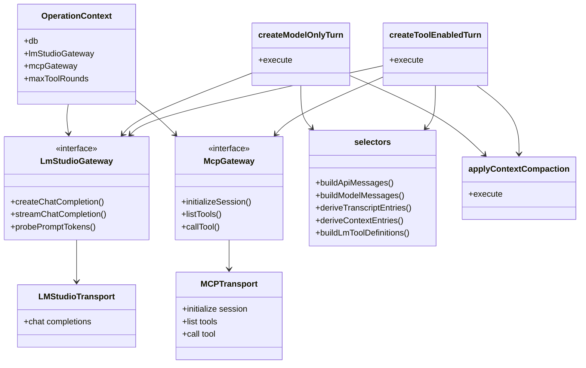

# Architecture

## Purpose and product position

This project is a **backend-centered runtime and diagnostics tool**, not a generic chat UI. It is built for:

- developing and debugging MCP server workflows
- studying multi-turn LLM behavior
- inspecting reasoning, tool choice, and context growth
- exporting runs that can be replayed as deterministic regressions

The value of the project depends on correctness and inspectability:

- token accounting must attach to canonical runtime state
- reasoning history must be preserved for study
- context trimming rules must be explicit and testable
- raw LM/MCP exchanges must be retained for replay and debugging

## Documentation boundaries

- [DATA-MODEL.md](DATA-MODEL.md) — compact canonical runtime tree, public part taxonomy, canonical IDs, and lookup-model rules
- [DATABASE-SCHEMA.md](DATABASE-SCHEMA.md) — current SQLite tables, foreign keys, singleton defaults, and ER diagram
- [CLI.md](CLI.md) — CLI command reference: commands, flags, output format, exit codes
- `ARCHITECTURE.md` — system design, persistence model, streaming model, replay model, and API overview

## Tech stack

**Backend:** Fastify + TypeScript, SQLite (better-sqlite3), LM Studio HTTP/SSE client, MCP HTTP client

**Frontend:** Svelte 5 + TypeScript + Vite — thin UI layer over backend-owned state, lives under `frontend/`

## Core architectural principles

- the backend owns the canonical runtime state
- SQLite is the canonical persistent store
- transcript and context are two views over the same runtime, not separate systems
- exported traces must stay replayable without reconstruction
- the frontend is a thin client over backend state
- command/tool interfaces are thin adapters over a backend-owned canonical operation catalog
- the MCP interface executes operations directly via the backend (no loopback HTTP)
- raw exchanges are preserved for diagnostics, auditing, and replay

## Product surfaces and contract sharing

mcpscope currently ships:

- a Web UI for human inspection and configuration
- a backend HTTP API as the canonical integration layer
- a packaged CLI for shell-native workflows
- an MCP interface for agent-native interaction (Streamable HTTP at `/mcp`)

These surfaces stay aligned around one backend-owned model and one backend-owned set of semantics.

### Backend-owned operation catalog

The canonical operation layer lives in `backend/src/operations/`. Each operation in the catalog defines, in one place:

- canonical operation ID
- user-facing description (used by both CLI help and MCP tool descriptions)
- input schema (Zod — canonical contract used by backend execution and MCP tool registration)
- output schema (Zod shape — used by MCP for structured output)
- execution function (calls backend directly — no loopback HTTP)
- machine-readable success shape (snake_case throughout)
- machine-readable error shape

The CLI and MCP interface are adapters over this backend-owned catalog:

- **CLI** — a thin remote adapter: argv parsing, stdin handling, text rendering, exit codes, and HTTP calls to the backend API
- **MCP** — a backend-native adapter: tool registration from the catalog, direct execution via `OperationContext`, structured output via `outputSchema` + `structuredContent`

Important rules:

- the backend owns operation semantics and execution
- the MCP interface does not call the backend API over loopback HTTP for shared operations
- the CLI calls the backend over HTTP (it is a remote adapter by design)
- machine-readable command semantics are defined once in `backend/src/operations/` (the single source of truth)
- presentation differences (text rendering, exit codes, MCP content formatting) are adapter concerns; semantic drift is not
- every new shared operation should be added once to `backend/src/operations/` and then exposed automatically through both adapters

## Runtime state and persistence

The canonical runtime model is defined in [DATA-MODEL.md](DATA-MODEL.md).

The backend persistence layer is organized around the execution model:

- `SessionContainer` — the domain-level ownership abstraction (see `backend/src/domain/executionModel.ts`)
- `Session` — the execution container; also a `SessionContainer`
- `Step` — the abstract execution unit; `Turn` is the LLM-specific subtype
- `Turn` — owns `Round`, `Part`, and `RawExchange` records (infrastructure-driven subtype persistence)
- `Benchmark` — a minimal `SessionContainer` that is not itself a `Session`

The persistence-layer record types remain the authoritative source for runtime behavior and replay:

- `SessionRecord`
- `TurnRecord`
- `RoundRecord`
- `PartRecord`
- `RawExchangeRecord`
- `BenchmarkRecord`

These map to the v2 persistence schema (`v2_sessions`, `v2_steps`, `v2_turns`, `v2_rounds`, `v2_parts`, `v2_raw_exchanges`, `session_containers`).

Normal startup initializes that runtime schema plus the shared config/default tables only. The legacy `sessions` / `turns` / `rounds` / `parts` / `raw_exchanges` tables remain available only through the explicit legacy initializer used by old-schema validation tests; they are not part of the normal runtime path.

### Current implementation

Today, mcpscope persists and exposes sessions as execution containers running on top of the canonical execution model:

- `Session.execute()` runs the execution loop by calling `advance()` while `canContinue()` is true
- `Session.advance()` executes the next `Step` (a `ChatTurnStep` for interactive chat sessions)
- `Step.execute(context)` runs the unit of work, delegating to `createModelOnlyTurn` / `createToolEnabledTurn`

The shipped product implements:

- `Session` and `Step` / `Turn` execution model with explicit loop boundaries
- `SessionContainer` ownership: sessions may belong to a parent session or a `Benchmark` container
- `Benchmark` as a minimal `SessionContainer` for grouping sessions (full benchmark domain design is future work)
- generic container/session/step persistence without table-per-subtype growth
- the current runtime tree (setup / turn / round / part) unchanged from user perspective
- `session_analysis` child sessions used by the analysis workflow
- compaction and context bookkeeping

What is **not** implemented yet:

- deterministic non-LLM step types beyond `Turn`
- full benchmark product work beyond minimal container support
- broader workflow automation

The important rule is:

- mcpscope should have one canonical model across persistence, API, UI, and CLI
- provider-specific transport structures are normalized into that model at the integration boundary
- `RawExchangeRecord` belongs to the diagnostic and replay layer, not to the canonical runtime tree

## Actual runtime ownership today

The current implementation is important to state explicitly because it is easy to imagine a dual-master design where:

- LM Studio owns the live conversational session state
- mcpscope separately stores its own inspect/runtime model

That is **not** how the backend currently works for LM Studio.

### Current ownership model

Today the implementation is closer to:

- mcpscope owns the canonical persisted runtime state in SQLite
- mcpscope reconstructs model request messages from that persisted state before each LM Studio call
- LM Studio is used as a stateless chat-completions transport, not as the owner of a native long-lived session object
- raw LM Studio request/response payloads are retained for diagnostics and replay, but they are not the authoritative session model

The one place where there is a real external session handle today is MCP:

- tool-enabled turns call `initializeSession(...)` on the MCP server
- the returned MCP `sessionId` is then reused for tool calls within that turn
- that MCP session handle is transient runtime state, not the canonical persisted mcpscope session model

So the current architecture is not a dual-master model. It is better described as:

- one canonical mcpscope runtime model
- plus transient and diagnostic transport-layer structures around it

### What is canonical vs derived vs transport

#### Canonical persistent records

These records are the authoritative mcpscope runtime state:

- `SessionRecord` (maps to `v2_sessions` + `session_containers`)
- `TurnRecord` (maps to `v2_steps` + `v2_turns`)
- `RoundRecord` (maps to `v2_rounds`)
- `PartRecord` (maps to `v2_parts`)
- `RawExchangeRecord` (maps to `v2_raw_exchanges`)
- `BenchmarkRecord` (maps to `session_containers` with `container_type_key = 'benchmark'`)

#### Derived in-memory request state

These structures are rebuilt from canonical records as needed and are not persisted as the primary model:

- `ApiMessage[]` from `buildApiMessages(...)`
- `ModelMessage[]` from `buildModelMessages(...)`
- derived transcript entries from `deriveTranscriptEntries(...)`
- derived context entries from `deriveContextEntries(...)`
- LM tool definitions from `buildLmToolDefinitions(...)`

#### Provider/service transport structures

These are provider-facing or service-layer structures, not the mcpscope domain model:

- LM Studio request bodies sent to `POST /chat/completions`
- `LmStudioChatCompletionResponse`
- `LmStudioChatCompletionChunk`
- `LmStudioStreamDelta`
- `LmStudioAssistantSegment`
- MCP raw exchanges and MCP tool-call results

Some of these are partially persisted for diagnostics:

- LM Studio request/response bodies are stored in `RawExchangeRecord`
- round-level `requestPayloadJson` and `responseTraceJson` keep a diagnostic mirror of transport activity

That diagnostic persistence does **not** make those transport structures canonical. The canonical runtime still lives in session/turn/round/part records.

### The practical consequence

For LM Studio, mcpscope is already much closer to "our representation is the master" than to "the provider's session is the master".

Before each model turn:

- mcpscope loads persisted parts for the session
- mcpscope derives the model-visible history from part `context_state`
- mcpscope builds a fresh `messages` array
- mcpscope sends that fresh request to LM Studio

After each model turn:

- mcpscope normalizes streamed/provider output into canonical `PartRecord`s
- mcpscope stores raw request/response exchanges for replay and debugging
- mcpscope applies its own compaction rules to canonical parts

So the main gap is not "move ownership away from LM Studio". The main gap is:

- generalize the mcpscope-owned runtime so it can represent more than LLM turns
- make the layered state model explicit enough to support deterministic workflow turns and richer context management

## Runtime structures and lifecycles

### Core record model and dependencies

### Execution-layer dependencies

### Lifecycle by structure

#### `SessionRecord`

Lifecycle:

- created by `createSession(...)`
- persists session-level configuration snapshots and compaction strategy
- updated as turns complete and session metadata changes
- remains the root of the canonical runtime tree

Dependency role:

- owns model-profile snapshot used to build LM Studio request bodies
- optionally owns MCP-profile snapshot used to initialize tool-enabled turns

#### `TurnRecord`

Lifecycle:

- created at the start of a user request
- moves through `streaming` to `complete` or `error`
- stores aggregate usage and post-turn compaction accounting

Dependency role:

- parent for one or more `RoundRecord`s
- anchor for turn-level outcomes and post-turn compaction metadata

#### `RoundRecord`

Lifecycle:

- created once per model iteration within a turn
- for model-only turns there is normally one round
- for tool-enabled turns there may be multiple rounds in a tool-call loop
- stores diagnostic copies of `requestPayloadJson` and `responseTraceJson`

Dependency role:

- binds one LM Studio request/response cycle to canonical persisted state
- links canonical parts to the provider round that produced them

#### `PartRecord`

Lifecycle:

- setup parts are created at session creation or MCP initialization time
- user parts are created at turn start
- assistant reasoning/content/tool-call/tool-result parts are created from provider outputs and tool activity
- compaction later mutates `context.state` on canonical parts instead of deleting transcript history

Dependency role:

- this is the most important structure for context reconstruction
- future model-visible context is derived from part `context.state`, not from provider-held session memory
- transcript and context views are both projections over the same parts table

#### `RawExchangeRecord`

Lifecycle:

- created whenever LM Studio or MCP traffic is captured
- persisted for replay, debugging, and auditability
- never becomes the authoritative semantic runtime model

Dependency role:

- diagnostic mirror of transport activity
- useful for replay and inspection, but subordinate to the canonical runtime tree

#### `ApiMessage[]` / `ModelMessage[]`

Lifecycle:

- rebuilt from persisted parts immediately before model calls
- never treated as the persistent source of truth
- discarded after request construction

Dependency role:

- bridge between canonical parts and provider chat-completion transport

#### LM Studio transport structures

Lifecycle:

- created for a single request/response exchange
- parsed into segments/deltas/chunks during streaming
- normalized into canonical parts
- persisted only as raw/diagnostic mirrors where needed

Dependency role:

- transport only
- no LM Studio-native session handle is used as authoritative runtime state today

#### MCP session handle

Lifecycle:

- created by `initializeSession(...)` at the start of a tool-enabled turn
- reused for MCP tool calls within that turn
- not part of the canonical persisted session model

Dependency role:

- external server-owned session handle for MCP interaction
- currently the main example of true external session state in runtime execution

## What is actually used during a session

### Model-only turn

The runtime flow is:

1. load the `SessionRecord`
2. load persisted `PartRecord`s for the session
3. ensure prelude token metadata is present
4. derive `ModelMessage[]` from canonical parts via selectors
5. send a fresh LM Studio `chat/completions` request
6. normalize streamed response into canonical assistant parts
7. persist raw exchanges and updated turn/round/session records
8. apply mcpscope compaction by mutating canonical parts

Important conclusion:

- the LM request is reconstructed from mcpscope state on every turn
- LM Studio is not carrying the authoritative conversational memory for us

### Tool-enabled turn

The runtime flow is:

1. load the `SessionRecord`
2. initialize MCP session context and fetch tools
3. persist MCP instructions and tool definitions as setup parts when needed
4. derive `ApiMessage[]` and tool definitions from canonical parts
5. send a fresh LM Studio request with `messages` and `tools`
6. normalize assistant reasoning/content/tool calls into canonical parts
7. call MCP tools using the transient MCP `sessionId`
8. persist tool results as canonical parts and MCP raw exchanges
9. build the next LM Studio request from accumulated canonical parts and repeat rounds as needed
10. persist final assistant response and apply compaction

Important conclusion:

- even in tool mode, later rounds are built from mcpscope-owned reconstructed messages
- the external MCP session handle is real, but it is scoped to tool interaction rather than replacing the mcpscope runtime tree

## Architectural assessment of the current gap

The current implementation is already partway toward a session-backed deterministic runtime.

What is already true today:

- mcpscope owns the canonical runtime model
- mcpscope decides what remains in future model-visible context via `context_state`
- mcpscope rebuilds LM Studio requests from its own persisted state
- compaction is already a backend-owned post-turn transformation over canonical parts

What is not yet generalized:

- turns are still structurally assumed to be LLM turns or tool-loop rounds
- deterministic workflow steps are not yet first-class turn types in the canonical runtime
- the distinction between transcript state, broader working state, and LLM-visible context is only partially explicit
- round/request diagnostic structures exist, but there is not yet a generalized runtime abstraction for non-LLM workflow nodes

So the main architecture question going forward is not "can mcpscope take ownership away from LM Studio?".

It is:

- how to generalize the already mcpscope-owned runtime so that deterministic workflow nodes can live beside LLM turns
- how to make layered context ownership explicit enough that future session-backed workflow execution stays coherent

### Current session classification limits

Session metadata around the runtime tree is already implemented:

- `session_type`
- `parent_ref`

The important architectural rule is:

> the setup/turn/round/part runtime tree stays the same; session type and parent link are metadata around the session, not a replacement for the runtime model

Implemented parent rules today:

- `primary` sessions may optionally belong to a `benchmark`
- `session_analysis` and `session_compaction` sessions must belong to a parent `session`
- `benchmark_analysis` sessions must belong to a `benchmark`

What remains intentionally limited in the current release:

- parent kinds are still limited to `session` and `benchmark`
- there is no turn-level or broader container-parent model yet
- benchmark support is still limited to the minimal container shape

Tracked tasks:

- `backlog/candidates/session-analysis-agent.md`
- `backlog/candidates/session-compaction-agent.md`
- `backlog/candidates/session-batch-runs.md`
- `backlog/candidates/benchmark-automation.md`

## Transcript vs context

The system intentionally maintains two separate views of the same run.

**Transcript** — the full user-visible history, including reasoning blocks and tool activity needed for analysis.

**Context** — only what will be sent to the model on later turns.

This distinction is central to the product: rich diagnostics without polluting later prompt state.

Reasoning behavior:

- reasoning stays in transcript history for inspection and later study
- reasoning is stripped from later model-visible context after the turn completes
- multi-block reasoning within one turn is preserved in the order it was produced

## Streaming model

True reasoning/tool/content ordering is taken from streamed LM Studio SSE events, not guessed from a final merged completion response.

The runtime captures:

- reasoning deltas
- content deltas
- tool-call deltas
- final usage payloads

These are assembled into committed backend parts so multi-block reasoning inside a single tool-enabled turn remains inspectable.

### Internal LM Studio service-layer types

The LM Studio client layer has its own internal type hierarchy:

- **`LmStudioChatCompletionChunk`** — one raw SSE chunk
- **`LmStudioStreamDelta`** — one typed transient increment derived from a chunk
- **`LmStudioAssistantSegment`** — one fully assembled response block in true production order

These are internal service-layer concepts. They are not the public runtime tree.

### Normalization into the canonical model

The runtime receives provider-specific LM Studio streaming structures and normalizes them into mcpscope parts.

| LM Studio segment kind | Canonical part type |
|---|---|
| `reasoning` | `reasoning` |
| `content` | `assistant_answer` |
| `tool-call` | `tool_call` |

Additional canonical part types come from setup or user / MCP interactions rather than LM Studio completion segments:

- `system_prompt`
- `mcp_instructions`
- `tool_definitions`
- `user_prompt`

Tool-result details are included inside the canonical `tool_call` node rather than creating a separate canonical part type.

### The word "delta" at two layers

The word **delta** appears at two different layers:

- **`LmStudioStreamDelta`** — internal LM Studio assembly increment
- **domain delta** — transient backend-to-frontend streaming update such as `part-delta`

They are related, but they are not the same concept.

## Tool-enabled turns

- assistant tool calls and tool results are persisted canonically per round
- selectors reconstruct the correct model-visible messages from persisted parts
- tool-call/result transport details normalize into one canonical `tool_call` node

## Token accounting

The goal is not to force fake exactness where the upstream API does not provide it:

- use exact probe and prompt-delta data whenever derivable
- prompt-token probes are stored as first-class raw exchanges so accounting is auditable
- use proportional allocation only when the API exposes a grouped total rather than per-part totals

## API surface

**Session lifecycle:**

- `POST /api/sessions`
- `POST /api/sessions/from-defaults` — create a session from backend-owned defaults
- `POST /api/sessions/:sessionId/initialize` — SSE initialization flow
- `GET /api/sessions/:sessionId/status` — compact lifecycle state for polling
- `GET /api/sessions` — lightweight session summaries for the sidebar
- `PATCH /api/sessions/:sessionId` — update session metadata such as title
- `DELETE /api/sessions/:sessionId`

**Turn execution:**

- `POST /api/sessions/:sessionId/turns` — blocking turn execution, returns the completed turn
- `POST /api/sessions/:sessionId/turns/start` — detached turn start for polling workflows
- `POST /api/sessions/:sessionId/turns/stream` — SSE streaming

**Session inspection:**

- `GET /api/sessions/:sessionId/trace` — canonical full diagnostic payload, including derived transcript and context views
- `GET /api/lookup/:id` — compact lookup by canonical hierarchical ID

**Configuration (backend-owned CRUD):**

- LM connections
- model configs
- MCP profiles

**Other:**

- `GET /api/domain-model`
- `POST /api/traces/import` — persists an imported trace bundle as a normal backend session

## Frontend role

The frontend is a thin client over backend state. Its responsibilities:

- render backend trace snapshots
- initiate actions such as session creation and turn submission
- support trace export/import workflows

Future UI work around session types and parent links should preserve the same principle:

- normal session views stay focused on normal primary sessions by default
- internal workflow sessions remain inspectable, but should appear from their parent object or in dedicated debug/development views

That behavior is future work, not part of the currently shipped UI model.
- expose inspect workflows over backend-owned IDs and lookup data

The frontend must not maintain its own parallel runtime model or re-implement runtime logic.

Key files:

- `frontend/src/lib/api/` — typed backend API client
- `frontend/src/lib/backendTypes.ts` — backend payload types
- `frontend/src/lib/connectionStore.ts` — backend CRUD for LM connections, model configs, MCP profiles
- `frontend/src/lib/sessionStore.ts` — session summaries, active trace loading, turn submission

### Streaming contract

1. The frontend keeps the latest backend trace snapshot in memory.
2. While a turn is live, the backend streams only small transient updates.
3. When a part is complete, the backend commits a canonical part and sends a `part-committed` event.
4. At round and turn boundaries the backend sends authoritative committed updates.

The frontend may hold a small in-memory overlay for currently streaming deltas, but it must discard that overlay as soon as committed backend parts arrive.

SSE event types emitted by `POST /api/sessions/:sessionId/turns/stream`:

1. `turn-started`
2. `round-started`
3. `part-delta`
4. `part-committed`
5. `round-committed`
6. `turn-committed`
7. `turn-failed`

### Import/export semantics

Export is the trace payload from `GET /api/sessions/:sessionId/trace`.

Import (`POST /api/traces/import`) takes the same shape and creates a persisted backend session. Imported traces are viewable through the same frontend code path as live sessions.

## Trace export and replay

The `/trace` endpoint is a product feature, not a testing hack. It exports the complete backend representation of a run:

- `session`, `turns`, `rounds`, `parts`, `rawExchanges`
- `transcript`, `context`

A captured run should be usable for debugging, support, analysis, and deterministic replay.

Replay happens at the backend runtime seam:

- feed recorded user turns
- replay recorded LM behavior
- replay recorded MCP behavior
- compare the resulting backend trace to the original

This keeps local regressions close to real runtime behavior without depending on live nondeterministic services. The replay harness lives at `backend/src/testing/replayHarness.ts`.

## Guiding constraints

- the canonical runtime tree is defined in [DATA-MODEL.md](DATA-MODEL.md)
- the backend remains the canonical source of truth
- SQLite remains the canonical store
- provider-specific transport structures must normalize into the canonical mcpscope model
- reasoning stays preserved in history even when stripped from later context
- the frontend may render transient deltas, but committed state always comes from the backend
- command-facing integrations should share one semantic contract rather than drift by surface
- raw LM/MCP exchanges remain available for replay and debugging
