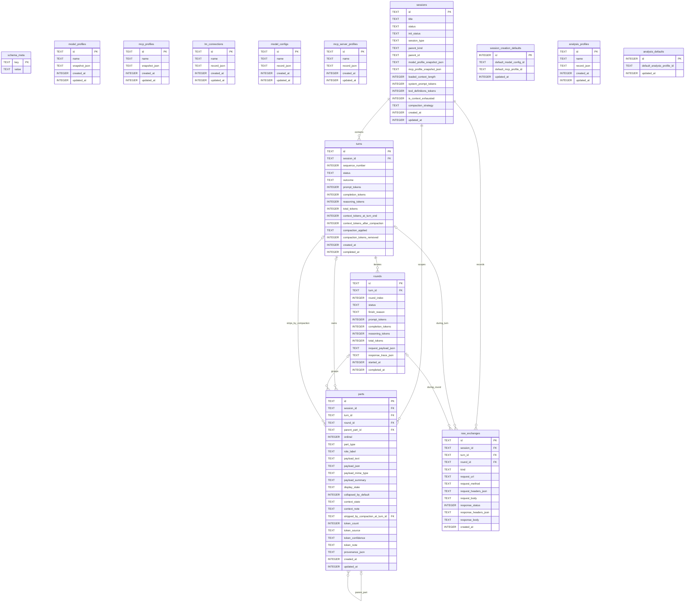

# Database Schema

This document describes the current SQLite storage layout used by mcpscope.

Source of truth:

- runtime schema creation and additive migrations live in `backend/src/persistence/schema.ts`
- record read/write behavior lives in `backend/src/persistence/repository.ts`

This is intentionally separate from [DATA-MODEL.md](DATA-MODEL.md):

- [DATA-MODEL.md](DATA-MODEL.md) describes the canonical runtime tree exposed across the product
- this file describes the backing SQL tables, foreign keys, singleton defaults tables, and snapshot/config catalogs

## Mermaid ER Diagram

## Relationship Notes

- `turns.session_id`, `rounds.turn_id`, `parts.session_id`, `raw_exchanges.session_id` are required foreign keys with `ON DELETE CASCADE`.
- `parts.turn_id`, `parts.round_id`, `raw_exchanges.turn_id`, and `raw_exchanges.round_id` are optional foreign keys. Setup parts live at the session level, so not every part belongs to a turn or round.
- `parts.parent_part_id` is a self-reference with `ON DELETE SET NULL`.
- `parts.stripped_by_compaction_at_turn_id` points at the turn that removed a part from active context and also uses `ON DELETE SET NULL`.

## Singleton Tables

- `session_creation_defaults` is a one-row table enforced by `CHECK (id = 1)`.
- `analysis_defaults` is also a one-row table enforced by `CHECK (id = 1)`.

Those tables store default selected IDs, but the schema does not currently enforce foreign keys from them to `model_configs`, `mcp_server_profiles`, or `analysis_profiles`.

## Snapshot and Catalog Tables

- `model_configs`, `mcp_server_profiles`, `lm_connections`, and `analysis_profiles` are editable configuration catalogs.
- `model_profiles` and `mcp_profiles` are snapshot catalogs written alongside session creation for historical inspectability.
- `sessions` keeps embedded JSON snapshots in `model_profile_snapshot_json` and `mcp_profile_snapshot_json`; it does not foreign-key to those snapshot catalogs.

## Constraints and Indexes

- Enumerated lifecycle columns are enforced with `CHECK (...)` constraints in `backend/src/persistence/schema.ts`.
- `turns` enforces `UNIQUE (session_id, sequence_number)`.
- `rounds` enforces `UNIQUE (turn_id, round_index)`.
- Secondary indexes exist on `turns.session_id`, `rounds.turn_id`, `parts.session_id`, `parts.turn_id`, `parts.round_id`, `raw_exchanges.session_id`, `raw_exchanges.round_id`, `sessions.session_type`, and `sessions.parent_kind + parent_id`.

## Current Schema Version

The current SQLite schema version is `7`, stored in `schema_meta.sqlite_schema_version`.