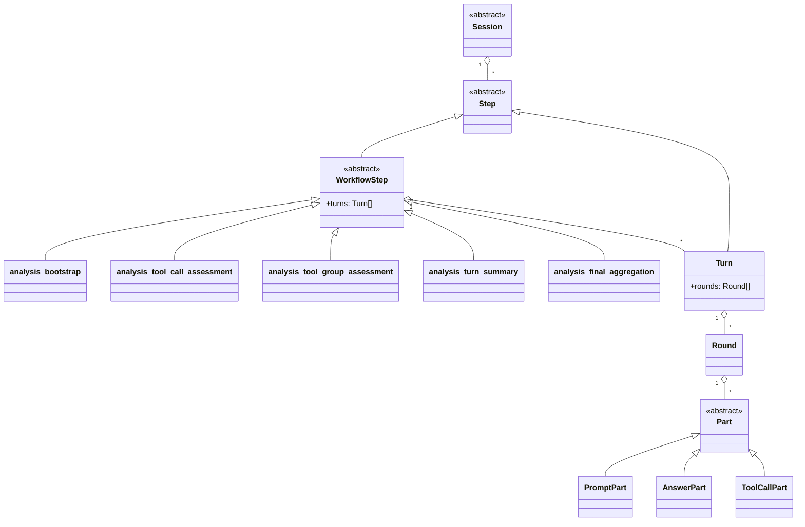

# Task to refactor the Steps to be a proper containement structure

This task also includes the follow-up of moving the analysis workflow "cursor" from a
pseudo-step (stored as `analysis_v2_cursor` in `v2_steps`) to a first-class session
state column (`analysis_state_json` on `v2_sessions`). The cursor was execution
state masquerading as a step — it was filtered out at 7 display sites, special-cased
in the scheduler, and occupied `ordinal: 0` (a position it had no business occupying).
Moving it to session state eliminated all filter sites, removed the ordinal-0 hack,
and made the cursor self-documenting.

## Goal

Make `Step` a first-class part of the canonical session containment tree, not a side-car concept. The session tree and the ID tree should match, so every node can be reached through its full hierarchical ID and the node type can be inferred from the ID alone.

This is a breaking change by design. We are not preserving legacy data or compatibility; the database may be wiped as part of the refactor.

Desired outcome:

- one canonical composite model for session containment
- step nodes visible in inspect, trace, and UI traversal like any other node
- IDs that encode the full path and the node type at each level
- less special-casing for analysis workflow steps, inspect, and UI rendering

## Acceptance criteria

- `Step` is modeled as a first-class container node in the runtime/data model.
- Step IDs are hierarchical and reflect containment, not just workflow ordinals.
- A node ID alone is enough to infer the node type at each segment.
- Inspect resolves sessions, steps, turns, rounds, and parts through the same containment model.
- UI rendering no longer needs a parallel step side-channel for analysis sessions.
- The refactor is implemented as one coordinated breaking change, not as a two-stage compatibility migration.
- The change stays focused on step containment, IDs, inspect, and analysis-session UI traversal; no broader execution-logic factoring is introduced in this task.
- Documentation updates at the end are limited to the sections in the runtime model and architecture notes that describe the changed containment tree, canonical IDs, and lookup/UI behavior.

Success should be visible in the backend model, inspect output, trace/export shape, and the frontend traversal/rendering path.

## Target structure

Implementation names today:

- `AnalysisSession`
- `FastSessionAnalysisSession`
- `FastToolAnalysisSession`
- `AnalysisWorkflowRuntime`

The concrete workflow nodes in the diagram are shown using the actual persisted `stepTypeKey` names used by the current implementation.



## Design decisions

- `Step` is abstract.
- `WorkflowStep` is abstract and sits under `Step`; it can own zero or more `Turn`s.
- `Turn` is a concrete `Step` subtype and can be a direct child of `Session` or a child of a concrete `WorkflowStep`.
- `Turn` owns `Round`s; below `Turn` the hierarchy does not change.
- `WorkflowStep` only contains `Turn` children at this stage.
- The ID grammar should mirror the type hierarchy using concrete-type suffix letters, similar to parts.
- Step IDs should use the sequence position plus a type suffix, e.g. `ABCD.3T` for a turn and `ABCD.4W` for a workflow step.
- `W` is the default suffix for `WorkflowStep`; subclasses may optionally override it with a different suffix if needed.
- All concrete analysis-session `WorkflowStep` subclasses use the default `W` suffix.
- Numbering is shared across all step subtypes within a session, like parts: the number is the step's position in the session's ordered step list.
- A nested path should preserve the full containment chain, e.g. `ABCD.4W.1T.3.3R`.
- We are accepting a breaking change and can reset the DB rather than maintaining backward compatibility.
- The refactor should be done in one pass so the data model, ID grammar, resolver, and UI all agree on the same tree shape.
- Keep the design compact and compositional: avoid separate side-car traversal paths where the tree itself can express the relationship.
- Keep the refactor minimal: focus on containment and IDs first, and do not try to factor or redesign the step execution logic in this step.

The concrete analysis-session `WorkflowStep` subclasses are:

- `analysis_bootstrap`
- `analysis_tool_call_assessment`
- `analysis_tool_group_assessment`
- `analysis_turn_summary`
- `analysis_final_aggregation`

Open items already settled:

- The inspect contract for `Turn` stays unchanged.
- `WorkflowStep` inspect returns the full subtree under that workflow step.
- Primary session UI remains unchanged.
- Analysis-session UI is updated to follow the composite containment structure, but the refactor effort stays minimal.

## Pre-implementation gates

- Freeze the target tree before coding: `Session -> Step -> WorkflowStep/Turn`, with workflow steps owning turns only.
- Freeze the ID grammar before coding: type-inferable suffixes, shared numbering within the session step list, and `W` for all concrete analysis workflow steps.
- Freeze the implementation boundary before coding: no execution-logic factoring, no primary-session UI redesign, no broader benchmark/session-parent work.
- Freeze the doc boundary before coding: only the affected runtime-tree, canonical-ID, lookup-rule, and analysis-session UI sections get updated at the end.


## Implemntation Steps

1. [done] Finalize the concrete `Step` / `WorkflowStep` / `Turn` split and confirm the typed suffix rule, with `W` as the default for workflow steps.
2. [done] Update the domain model and persistence contracts to represent `WorkflowStep` as abstract and owning turns, without changing step execution behavior.
3. [done] Refactor hierarchical ID parsing/formatting so IDs encode the full path and concrete node type.
4. [done] Update inspect / lookup resolution so `Turn` inspect stays the same and `WorkflowStep` inspect returns the full subtree.
5. [done] Rework trace serialization so workflow steps and their descendant turns/rounds/parts are emitted as part of the same hierarchy.
6. [done] Update analysis-session scheduling and step ownership only as needed to fit the new containment shape.
7. [done] Remove or reduce analysis-session UI side paths that only exist because steps are modeled separately; keep primary-session UI unchanged.
8. [done] Add or update tests for ID parsing, inspect traversal, trace shape, and analysis-session rendering.
9. [done] Update [DATA-MODEL.md](../DATA-MODEL.md) and any directly affected architecture notes to match the new step containment and ID model, changing only the sections that describe the runtime tree, canonical IDs, lookup rules, and analysis-session inspect/UI behavior.
10. [done] Validate the end-to-end flow with the new tree, then clean up any remaining compatibility code.

### Step gates and checks

- Step 1 gate: the class diagram, subclass list, and naming are final; there are no remaining shape questions.
- Step 2 gate: the domain model compiles with the new abstract/concrete split and no logic paths were refactored.
- Step 3 gate: ID parse/format rules cover the settled tree and all concrete analysis workflow steps use the shared `W` suffix.
- Step 4 gate: `Turn` lookup behavior is unchanged, while `WorkflowStep` lookup returns its full subtree.
- Step 5 gate: trace output reflects the composite step subtree without changing unrelated session or part semantics.
- Step 6 gate: scheduling still behaves the same from the user's point of view; only ownership/containment wiring changes.
- Step 7 gate: primary-session UI remains effectively unchanged; analysis-session UI follows the composite structure.
- Step 8 gate: the new and existing tests that cover containment, IDs, inspect, trace, and analysis UI pass.
- Step 9 gate: documentation is updated only where the changed model is described, and it matches the implemented tree and IDs.
- Final gate: the end-to-end refactor is coherent, and no compatibility scaffolding is left behind in the touched slice.

---

# Schema alignment for containment model

## Current schema problems

1. **Turn stored in TWO tables** (`v2_steps` + `v2_turns`). `v2_turns.step_id` is the PK _and_ references `v2_steps.id`. Owned turns have no business occupying a slot in the session-wide step ordinal space.
2. **Session-wide `ordinal` and `sequence_number`** conflict with per-parent containment numbering.
3. **Inconsistent parent references**: `v2_rounds.step_id` points to `v2_steps`, `v2_parts.turn_id` points to `v2_turns`. Same concept, different columns.
4. **Redundant `session_containers` table** — sessions are containers themselves.
5. **Legacy runtime tables** (`sessions`, `turns`, `rounds`, `parts`, `raw_exchanges`) still exist in code paths.

## Target outcome

| Current | Target |
|---------|--------|
| `v2_steps` holds turn records + workflow records | `v2_steps` holds only workflow / compaction records; **no turn entries** |
| `v2_turns.step_id` PK = FK to v2_steps | `v2_turns.id` PK (no FK to steps for owned turns) |
| `v2_steps.ordinal` (session-wide) | `v2_steps.child_index` (position within session, no gaps from owned turns) |
| `v2_turns.sequence_number` (session-wide) | `v2_turns.turn_number` (position within parent: owner_step or session) |
| `v2_rounds.step_id` → v2_steps | `v2_rounds.turn_id` → v2_turns |
| `getNextStepDisplayNumber` + `getNextStepOrdinal` (two counters) | `getNextStepOrdinal` only (no more owned turns to filter out) |
| `number` field in inspect derived from ordinal+1 or ID parsing | removed — the ID `22W.1T` **is** the position |
| `session_containers` table | dropped |
| Legacy runtime tables | dropped |

## Implementation steps

### Step 1: Schema migration
Update `schemaV2.ts` table definitions:

- `v2_steps`: rename `ordinal` → `child_index`, add `parent_step_id TEXT` (nullable, future use)
- `v2_turns`: rename `step_id` → `id`, remove FK to v2_steps, rename `sequence_number` → `turn_number`, remove `session_id` UNIQUE constraint on (session_id, turn_number) — use per-parent counting instead
- `v2_rounds`: rename `step_id` → `turn_id`, FK to v2_turns
- Add migration ALTER TABLE statements for existing DBs (optional since fresh DB is fine)
- Drop `session_containers` table
- Drop legacy tables

**Gate**: `initializeBackendSchema()` creates tables successfully. `validateNewSchema()` passes.

### Step 2: Domain model update
Update TypeScript interfaces:

- `StepPersistenceRecord`: rename `ordinal` → `childIndex`
- `TurnRecord`: rename `sequenceNumber` → `turnNumber`
- `RoundRecord`: rename `stepId` → `turnId`
- Remove `StepRecord` type if no longer in use after step changes

**Gate**: Backend types compile.

### Step 3: Persistence layer refactor
Rewrite `repositoryV2.ts` and `repositoryRuntime.ts`:

- `insertStepRecord`: use `childIndex` instead of `ordinal`, add optional `parentStepId`
- `insertTurnRecord`: when `ownerStepId` is set, **skip** `insertStepRecord`. Only insert into `v2_turns`. Compute `turnNumber` as `COUNT(*) + 1 WHERE owner_step_id = ?`.
- `getNextStepOrdinal` → `getNextChildIndex(sessionId)`: count steps where `parent_step_id IS NULL` only
- Remove `getNextStepDisplayNumber` (no longer needed)
- Remove `getNextOwnedTurnSequenceNumber` (per-parent counting is done inline)
- `getNextTurnSequenceNumber` → use per-parent counting for owned turns
- Update all row mapping functions for renamed columns

**Gate**: Repository functions compile and write the correct data shapes.

### Step 4: Stop creating step records for owned turns
In every code path that creates turns with `ownerStepId`:

- Analysis workflow turn creation (`boundedTurn.ts` → `toolTurns.ts`, `modelTurns.ts`) — already uses `turnDisplayNumber`, now the underlying `insertTurnRecord` handles per-parent counting
- Top-level turns (primary sessions) still create `v2_steps` records
- Remove the `stepRecordSchema` for turn-type steps where unnecessary

**Gate**: All turn-creation paths compile. Owned turns only exist in `v2_turns`.

### Step 5: Update hierarchical IDs and inspect
- `formatStepId(sessionId, childIndex)` — uses `childIndex` directly, no extra counter
- `formatTurnId` — turn number comes from per-parent count
- `parseHierarchicalId` — validate against new ID format
- `hierarchicalLookup.ts` — no longer looks for turn step records; reads turns directly from `v2_turns`. Remove `number` field from inspect output (the ID is the position).
- `buildStepNode` — only handles non-turn steps

**Gate**: Inspect output reflects containment position in IDs. No `number` field.

### Step 6: Update trace and API routes
- `trace.ts` — remove turn-type step handling from `buildStepNode`, update `deriveWorkflowSteps`
- `sessionRoutes.ts` — remove cursor step references (already done), update turn listing
- `schedulerRoutes.ts`, `schedulerAdmission.ts`, `schedulerDispatch.ts` — already updated to use session state
- `operations/status.ts`, `operations/list.ts` — update if needed

**Gate**: Trace output and API responses match new schema. All route tests pass.

### Step 7: Frontend and CLI update
- `frontend/src/lib/backendTypes.ts` — update schema types
- `frontend/src/lib/components/ChatView.svelte` — no `number` field in turn display
- `frontend/src/lib/sessionStore.ts` — update stream event handling for renamed fields
- CLI: update type schemas and display code

**Gate**: Frontend and CLI typecheck pass.

### Step 8: Clean up and remove dead code
- Remove `session_containers` table, `SessionContainerRecord`, and all related code
- Remove legacy runtime tables (`sessions`, `turns`, `rounds`, `parts`, `raw_exchanges`) and all old-schema paths
- Remove `getNextStepDisplayNumber` (already unused)
- Remove `number` field from inspect/trace types
- Update all tests for renamed columns and removed concepts

**Gate**: All tests pass. No dead code references remain.

### Step 9: Update documentation
- Update `DATA-MODEL.md` — remove `number` from Turn/Round/Part property tables, note that the ID IS the position
- Update `DATABASE-SCHEMA.md` — reflect new table shapes

**Gate**: Docs match implemented schema.

---

# Compaction step unification

## Current problem

Compaction steps live in a **separate number space** from workflow steps:

- Workflow steps use `getNextStepDisplayNumber` (which **excludes** compaction via `step_type_key != 'compaction'`)
- Compaction steps use `getNextChildIndex` (which **includes** all steps)
- Two counting functions (`getNextStepDisplayNumber` + `getNextChildIndex`) that should be one

This creates:
- Workflow IDs like `1W`, `2W`, `3W`... (consecutive, skipping compaction)
- Compaction IDs like `C6`, `C10`, `C14`... (childIndex-based, with gaps)
- A persistent source of bugs: the collision fix, the reserved-turn-number parsing bug, and the conceptual confusion all trace back to this dual-counter design

## Desired state

All steps share **one** number space. The number is the step's zero-indexed position in the session's flat step list:

```
1W  (bootstrap)
2W  (assessment)
3W  (assessment)
4W  (turn_summary)
5C  (compaction)         ← same numbering, C suffix
6W  (next assessment)
7W  (next assessment)
8W  (turn_summary)
9C  (compaction)
10W (final_aggregation)
```

`childIndex` IS the display number. No separate counting, no exclusions.

## Changes needed

1. **Remove `getNextStepDisplayNumber`** from `repositoryV2.ts` — the function is no longer needed
2. **Replace all its call sites** with `getNextChildIndex` across 6 workflow files
3. **Update `formatCompactionStepId`** — already takes a number parameter, just confirm it produces `{id}.{N}C`
4. **Verify `compaction.ts`** already uses `getNextChildIndex` correctly (it does — `childIndex` is computed at line 121 and used for both the ID and the DB column)
5. **Update tests** — step numbering now includes compaction in the count; test expectations that assert specific step IDs will need adjustment

## Impact

| What | Count |
|------|-------|
| Files changed | ~10-12 (6 workflow + 2 persistence + 2-4 tests) |
| Functions removed | 1 (`getNextStepDisplayNumber`) |
| Functions simplified | `getNextChildIndex` becomes THE step counter |
| New concepts | None — this is removal of accidental complexity |
| Test impact | Numbering expectations shift; artifacts referencing step IDs |

## Assessment

This is a **simplification that removes accidental complexity**. The dual-counter design was a workaround for compaction steps being treated as second-class citizens. Making compaction participate in the shared numbering eliminates:

- The compaction ID collision bug (already fixed with a targeted patch)
- The reserved-turn-number parsing bug (already fixed with a targeted patch)
- The mental overhead of tracking two parallel number spaces
- The need for `getNextStepDisplayNumber` entirely

The change itself is mechanical (search-and-replace + delete). The risk is test assertion drift on step numbering — but since we already allow fresh databases and the current tests mostly use pattern matching rather than exact ID assertions, the impact is small.