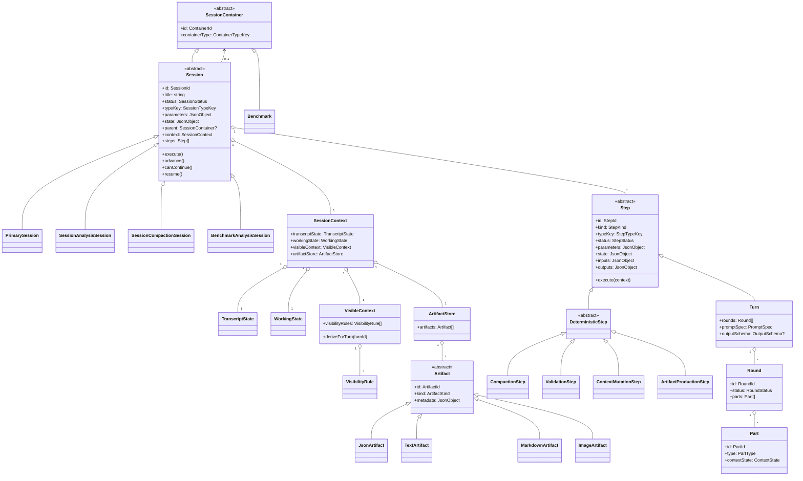

# Session-backed deterministic harness data model

## Purpose

Define the target runtime model, persistence model, and class structure for extending mcpscope from a chat-session model to a session-backed execution model.

This specification is intentionally result-oriented. Background reasoning belongs in `research/agent-harnessing.md`.

## Fixed decisions

## Implementation decisions for this increment

The following decisions are settled for the implementation increment that follows this specification.

- this increment is a refactoring onto the new data model and execution model, not a product-level behavior rewrite
- current backend, HTTP/API, CLI, MCP, and UI behavior must remain functionally aligned unless a change is explicitly called out
- `Session.execute()` is the full execution loop
- `Session.execute()` repeatedly calls `advance()` while `canContinue()` is true
- `Session.advance()` performs one orchestration advancement
- `Step.execute(context)` performs one instantiated step's execution
- `SessionContainer` is the domain-level ownership abstraction
- `Session.parent` should be modeled as `SessionContainer?`, not as a persistence-shaped parent reference object
- `Session` itself is a `SessionContainer`
- `Benchmark` is introduced now as a minimal `SessionContainer`
- benchmark support in this increment is limited to validating the container model, not expanding the benchmark product surface
- persistence is generic by default for containers, sessions, and steps
- new concrete session and step classes should not require schema changes by default
- subtype-specific persistence is allowed only for infrastructure-relevant cases such as `Turn`
- artifact polymorphism is based on content type, not semantic workflow meaning

### 1. Execution vocabulary

- `Session` is the execution container
- `Step` is the abstract execution unit
- `Turn` is the LLM-specific subclass of `Step`
- `Round` and `Part` remain specific to `Turn`

Top-level language should therefore be:

- `Session -> Step[]`
- `Turn` means LLM turn
- deterministic work is represented by other `Step` subtypes

### 2. Runtime responsibility split

- concrete `Session` types own orchestration semantics
- concrete `Step` types own unit execution semantics
- session types decide which step to instantiate or resume next
- step types execute once their inputs are populated

Recommended method split:

- `Session.execute()`
  - runs the session until it can no longer continue
  - loops while `canContinue()` is true
  - calls `advance()` repeatedly
- `Session.advance()`
  - orchestration-oriented
  - decides what step comes next and performs one advancement of execution
- `Step.execute(context)`
  - unit-of-work execution
  - runs the already-instantiated step

This keeps full session execution distinct from one-step orchestration and from step-local execution.

### 2a. Container model

- the domain model should not expose a database-oriented `ParentRef` object as the main ownership abstraction
- introduce a `SessionContainer` abstraction in the domain model
- `Session` should have `parent: SessionContainer?`
- `Session` itself can act as a `SessionContainer` when child sessions are attached to it

This keeps container ownership as a domain concept while leaving foreign-key details to persistence mapping.

### 3. Persistence model

- no backward compatibility is required for this increment
- no database migration is required
- the new schema should adopt the clean terminology directly
- persistence is trace-oriented and incremental
- workflows are not fully pre-instantiated and stored up front
- persistence should be generic enough that new session and step classes do not require schema changes by default

Persisted state should contain:

- the session instance
- the session type key
- persisted session parameters
- generic persisted session state needed to resume
- the instantiated execution trace so far
- generic persisted step inputs, outputs, and state

Persisted state should not contain:

- a fully expanded future workflow plan serialized up front
- subclass-specific tables for every new session or step type by default

### 4. Context model

The session context must separate:

- transcript state
- working state
- visible context
- artifact storage

Visible context should be:

- explicit in the domain model
- derived from persisted state
- controlled by persisted visibility rules or inclusion/exclusion state when needed

Visible context should not be:

- a duplicated persisted copy of the full underlying data structures

### 5. Artifact model

Artifacts should be first-class persisted objects, but the polymorphism should follow content representation rather than workflow semantics.

Preferred first-step direction:

- artifact subclasses by content type, not by semantic meaning
- semantic schema, validation, and usage rules belong to the session/step types that consume the artifacts

Recommended artifact hierarchy:

- `Artifact` (abstract)
- `JsonArtifact`
- `TextArtifact`
- `MarkdownArtifact`
- `ImageArtifact`
- additional content-oriented artifact types only when they provide concrete storage, validation, or rendering value

Not recommended as the primary hierarchy:

- `ToolCallAssessmentArtifact`
- `CoverageMapArtifact`
- `TurnOutcomeAssessmentArtifact`

Those should instead be modeled as:

- semantic schemas over a generic content artifact type
- session/step-specific validation logic
- domain conventions owned by the workflows that use them

### 6. Polymorphism boundary

Use polymorphism primarily in the domain layer, not as a reason to create new persistence tables for every concrete subtype.

This means:

- new concrete `Session` types should normally map to the same generic session persistence structures
- new concrete `Step` types should normally map to the same generic step persistence structures
- the persistence layer stores type keys plus generic parameter/state payloads
- only infrastructure-relevant differences should justify dedicated subtype tables

Examples of infrastructure-relevant differences:

- `Turn` needs LLM-specific structures such as rounds, parts, and raw exchanges
- artifact content types may need different storage, validation, or rendering behavior

Examples that should not force new tables by default:

- a new workflow-specific session class
- a new deterministic step class with custom orchestration semantics
- a new semantic use of a JSON artifact

### 7. Benchmark container planning

- it is reasonable to introduce the extra container abstraction now as part of the same overhaul
- it is also reasonable to plan a minimal `Benchmark` domain container now
- this should stay intentionally thin in this increment

What should be included now:

- `Benchmark` as a `SessionContainer`
- a generic way for sessions to belong either to another session or to a benchmark container
- persistence support for the container identity and type

What should not be included now:

- a full benchmark-domain redesign
- benchmark-specific workflow semantics beyond what is needed to validate the container model
- UI/product expansion beyond parity with current behavior unless separately specified

Reason:

- the container abstraction is already needed to clean up parent modeling
- benchmarks are the clearest upcoming case where the parent is not naturally another session
- adding the minimal container shape now avoids another near-term model rewrite

### 8. Refactor and parity requirement

This increment is a refactoring of mcpscope onto the new data model and execution model.

Acceptance intent:

- all current user-visible functionality should continue to work
- backend behavior should remain equivalent unless a change is explicitly part of the task
- HTTP/API, CLI, MCP, and UI flows must all stay aligned with the refactored model

The implementation task that follows this specification must include an incremental plan that covers:

- persistence migration to the new fresh schema
- domain-model introduction and mapping
- backend operation parity
- CLI adapter parity
- MCP adapter parity
- UI parity for listing, inspection, execution, and related current flows
- focused validation at each step so parity regressions are caught early

## Target domain model

### Sessions

- `SessionContainer` (abstract)
- `Session` (abstract)
- `PrimarySession`
- `SessionAnalysisSession`
- `SessionCompactionSession`
- `BenchmarkAnalysisSession`
- `Benchmark`

`Session` should inherit from `SessionContainer` so a session can contain child sessions.

`Benchmark` should also inherit from `SessionContainer`, but only as a minimal container concept in this increment.

Each concrete session type owns:

- workflow parameters
- orchestration logic
- rules for selecting or deriving visible context
- workflow-specific artifact semantics and validation rules

### Steps

- `Step` (abstract)
- `Turn`
- `DeterministicStep` (abstract)
- `CompactionStep`
- `ValidationStep`
- `ContextMutationStep`
- `ArtifactProductionStep`

Each concrete step type owns:

- execution logic
- step-local input and output interpretation
- workflow-specific validation rules

### Context

- `SessionContext`
- `TranscriptState`
- `WorkingState`
- `VisibleContext`
- `VisibilityRule`
- `ArtifactStore`

### Artifacts

- `Artifact` (abstract)
- `JsonArtifact`
- `TextArtifact`
- `MarkdownArtifact`
- `ImageArtifact`

## Target class model

## Target persistence shape

### Generic session tables

- `sessions`
  - common identity, lifecycle, container metadata, type key, parameters, resumable state

### Container tables

- `session_containers`
  - common container identity and container type
- `benchmarks`
  - minimal benchmark container data only if benchmark-specific metadata is needed immediately

### Generic step tables

- `steps`
  - common identity, session FK, order, type key, status, parameters, state, inputs, outputs

### LLM-specific execution tables

- `turns`
  - LLM-turn-specific fields only
- `rounds`
- `parts`
- `raw_exchanges`

### Context and artifact tables

- `session_contexts`
- `visibility_rules`
- `artifacts`
- `json_artifacts`
- `text_artifacts`
- `markdown_artifacts`
- `image_artifacts`

## Persistence strategy

### Generic mapping rule

The default rule is:

- polymorphic domain types map to generic persistence rows using type keys plus structured payload fields
- adding a new concrete session type should not require a new session table by default
- adding a new concrete step type should not require a new step table by default
- adding a new concrete container type should not require a new container table by default
- the UI should not need subtype-specific code to list, inspect, or store ordinary sessions and steps

### Where subtype-specific persistence is allowed

Subtype-specific persistence is justified only when the subtype has infrastructure-relevant data that cannot reasonably live in the generic shape.

Current expected case:

- `Turn` has dedicated persistence because rounds, parts, and raw exchanges are structurally distinct and already meaningful infrastructure concepts

### Consequence for extensibility

This design is intended to support future extension where new session and step classes can be introduced by code without requiring changes to:

- the base schema
- the base repository layer
- generic UI inspection flows

For containers, the same principle should hold unless a new container type introduces infrastructure-level storage needs.

The extension contract should be based on:

- type keys
- generic parameter/state/input/output payloads
- optional workflow-owned validation logic
- optional content-type-specific artifact handling

## Required boundaries

- `Turn`, `Round`, and `Part` remain LLM-specific
- deterministic steps do not need synthetic rounds or parts
- artifact semantics are not encoded as artifact subclasses by default
- workflow semantics live in session and step types, not in the base artifact model
- container ownership is a domain concept and should not leak as `ParentRef` into the object model
- domain polymorphism does not imply one SQL table per concrete subtype
- the new schema should optimize for clarity and future extension, not for compatibility with the previous `turn`-centric schema

## Acceptance criteria for the implementation task

The implementation-ready task derived from this specification should use acceptance criteria along these lines:

- the runtime model uses `Session`, `Step`, and `Turn` with the responsibilities defined in this specification
- the domain model uses `SessionContainer` ownership instead of a persistence-shaped parent reference object
- a minimal `Benchmark` container is supported by the model and persistence layer
- the persistence model is generic by default for containers, sessions, and steps
- new workflow-specific session and deterministic step types can be added without introducing new persistence tables by default
- `Turn`, `Round`, `Part`, and `RawExchange` continue to support the current LLM execution behavior
- current functionality remains working across backend, HTTP/API, CLI, MCP, and UI surfaces
- the implementation plan is staged so parity is preserved and validated incrementally during the refactor

## What this task must produce next

This specification should lead to an implementation-ready backlog task that defines:

- the new domain classes and repositories
- the fresh SQL schema for containers, sessions, steps, turns, and artifacts
- the generic mapping contract for session and step persistence
- the generic mapping contract for container persistence
- how current LLM execution data maps into `Turn`, `Round`, and `Part`
- how visible context derivation and visibility rules are persisted
- the first generic artifact storage and validation path
- the staged rollout plan required to preserve backend, CLI, MCP, and UI parity during the refactor

## Out of scope

- implementing the framework in this task
- final workflow-specific semantic schemas for artifacts
- final workflow logic for every session type
- plugin packaging details
- UI redesign
- benchmark-domain design beyond the runtime/data-model substrate
