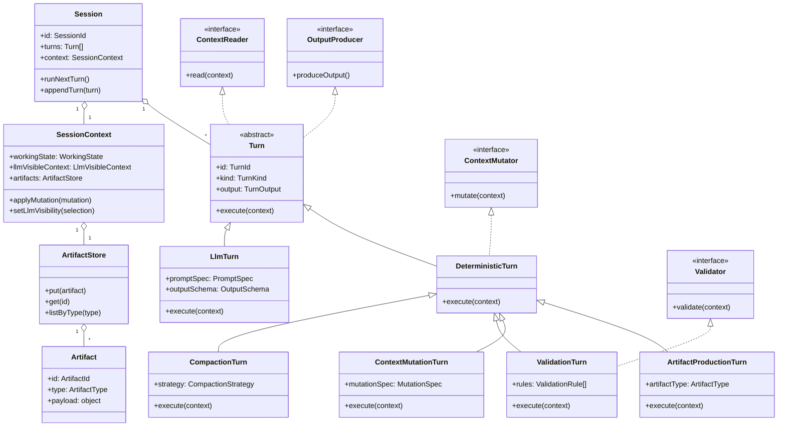

## Motivation / Question

When it come to the next step to start more elaborate analysis protocol than the "one shot" prompt based approache we have tried so far, we need to figure out how we are going to experiment with this "semi automatically / manually" and how we can implement such prototols in a good way and without re-inventing the wheel.

This is for that kind of think that people talk about agentic framework and use the agent "harnessing" expression these days. I would like to research a bit how people are implementing such multiturn agent before we impelment anything. 

This is a pure research task which we can put in the research folder as "agent_harnessing" and for which we can do a search online and in key project to undestand how people are implementing the agentic loop and combining deterministic workflows with llm turns/rounds to acheive a goal.

For our session analysis, we are talking about having the agent look at the various turns and tool calls in detail, extract a set of info from each and then processed to combine the information in a second pass to undestnand rounds and turns.

Here is one way we could implement this:
* Start the analysis and feed the model with the overall goals and outline of the conversation (the result of "inspect session"). The session will always keep that in its context. 
* Then we force one turn per tool call in the session where we force the model to read the full resoning before the tool call and the tool call itself as well as maybe the resoning after and ask the model to answer the specific questions about "Why the tool call was choosen?" and "how did it go?" (questions and output format should be way more specific that this). At then end of the turn for each such turn, we strip the context from the verbose result from calling "inspect" for teh resoning blocks and tool call which probably use a lot of context and which are no longer relevant since we have not the facts as the output from the turn. it is a  a special session-compaction strategy.
* After all tool calls have been processed we should be left in the context with the facts about each of them and it is at this point that the sequence can be analysed based on that.

This example is very tool call oriented, after experimentation we might have more steps but the question here is the architecture and workflow to do these kind of custome agents to whom we impose a workflow and for which we are adapting our context compation to fit the usecase and have the model focus on the exact data we want ti to consider.

I think this approach is cool and elegant but I want to know what people are doing. And I can see that we can also implement the same kind of workflow to be a deterministic workflow (not a session) and then use a bunch of session with a single turn in which we feed all the information in the prompt and ask for the answer. Ie. a set of simple session, for example one per tool call and then the deterministic workflow agregates the results and control excaly what is given to the next session. This is more adhoc and in a way simpler but it is more rigid, I like the idea of having a guided session in which we may experiment giving more or less autonomy to the model to see what works best as opossed to impelmenting a rigid framework. I also like the idea of using context engeeneering to keep the memory about the ongoing analysis and potentially the fact that we might be way more token efficient since we are building a single session and compacting each turns.

My idea of an "elegant" steared session is still to but in full control of each turn when we want in terms of inputs and outputs. If you look at how we have been thinking of compation in the project, it is also a very deterministic and transparent process which is controled by the harness and in terms of transparency, mcpscope is all about being able to inspect the session context, including knowing and being able to pull back the parts of converstation which have been stripped. So that is why I consider that we potentially have an elegant and token efficient way to fully impelment the level of determinism and transparency by using the session memory as the working memory.

In that sense what we have of features in mcpscope related to context management and related to how we expose the context in a transparent way provides opportunities to build not only test sessions for mcp server but can be useful for any usecase where context and compaction need to be transparent, inspectable and potentially manipulate by task specific rules, ie. we can make task specific or event subtask specific turn compaction strategies.

## Research results

## High-level conclusion

The clearest common result is that serious agent systems are usually not built as one unconstrained conversation. The dominant pattern across the frameworks reviewed is:

- explicit workflow shape in code
- explicit state or memory artifacts between steps
- structured intermediate outputs
- bounded model judgments inside the workflow
- checkpoints, validation, and optional approval where mistakes matter

So the ecosystem trend is closer to controlled orchestration with LLM steps than to "one smart autonomous session".

That does not invalidate the guided-session idea. It changes the standard for when it is a good design: teams that make it work usually add deterministic scaffolding around it, including step boundaries, artifact contracts, gating, and explicit memory or compaction policy.

## Consolidated findings

### 1. Explicit state beats implicit transcript memory

This is the strongest repeated pattern. LangGraph, Semantic Kernel, OpenAI sessions, AutoGen message filtering, and Pydantic AI all treat important working state as something more explicit than raw chat history.

The practical lesson for mcpscope is that the authoritative state for session analysis should be compact artifacts such as coverage maps, round ledgers, tool-call assessments, and turn-outcome judgments, not a growing transcript.

### 2. Intermediate artifacts should be structured, narrow, and machine-checkable

Across frameworks, the model is usually asked for bounded outputs that code can validate and reuse: typed objects, ledgers, classifications, evaluator results, or step-local reports.

For mcpscope this supports asking narrow factual questions such as:

- why was this tool selected?
- what result did it actually return?
- did the result match what the model appeared to expect?
- if not, is the most direct observed cause parameters, tool understanding, tool description, or a real tool limitation?

That also suggests treating the unit of work as an `assessment task`, not a raw turn. Sometimes one assessment task is one tool call, but sometimes it must include reasoning before the call, the payload, the exact result, and the next reasoning step.

### 3. Checkpoints, gates, and resumability are first-class features

LangGraph interrupts and checkpointers, OpenAI resumable runs, Pydantic durable wrappers, and Semantic Kernel process state all assume multi-step workflows can pause, fail, or require approval.

For mcpscope, this supports:

- machine-checkable coverage gates
- explicit rejection of unsupported synthesis
- retry points between stages
- visible compaction and resume boundaries

### 4. Tool and interface design are part of the solution

Anthropic states this directly, but the same assumption appears everywhere tools are typed, filtered, or schema-validated. Tool descriptions, parameter names, and result shapes are not side details; they are part of the control surface.

This is directly relevant to mcpscope because the earlier findings about `mcpscope_inspect` were not incidental. Reducing ambiguity in tool semantics is part of making the analysis workflow reliable.

### 5. Decomposition is normal: extractor plus synthesizer, or orchestrator plus workers

The usual pattern is to let one stage extract or assess bounded facts and a later stage synthesize them. This appears as orchestrator-workers, evaluator-optimizer, typed hand-offs, or process steps depending on the framework.

For mcpscope, that argues against mixing extraction, adjudication, and MCP-surface diagnosis in one pass.

## What the frameworks contribute

- Anthropic gives the clearest high-level rule: start with workflows, not agents, and only add autonomy when the task truly needs it.
- OpenAI Agents SDK is the best concrete reference for a harness-owned guided session with explicit sessions, compaction, filtering, and approvals.
- LangGraph is the clearest model for a backend-owned state graph with checkpoints, interrupts, reducers, and inspectable state snapshots.
- AutoGen is the best reference for separating the execution graph from the message graph, which is highly relevant to transparent compaction and selective memory.
- Semantic Kernel is the clearest process-style reference: stateful steps, event routing, subprocesses, and versioned persisted state.
- Pydantic AI shows the value of typed outputs, explicit history passing, and code-owned hand-offs between bounded runs.

## Implications for mcpscope

The research points to two different design questions that should be kept separate:

- control shape: how deterministic the workflow is, how much initiative is delegated to the model, and whether the primary logic lives in code or in the LLM loop
- implementation substrate: where that workflow actually runs, and whether the authoritative working state lives in a session backbone or in an external workflow runtime

The earlier discussion about autonomy, determinism, and bounded stages remains useful, but it should not be confused with the implementation choice of whether mcpscope sessions themselves become the native runtime for deterministic agent workflows.

## Control-shape options

### Guided session: viable, but only if tightly scaffolded

A steered session can still be deterministic and transparent if the harness owns:

- the turn sequence
- the evidence slice shown at each turn
- the artifact written at each turn
- the compaction policy
- the surviving memory after compaction

In that design, the session memory is really a visible working ledger, not an unconstrained conversation.

### Deterministic multi-run workflow: fully respectable and often simpler

Many frameworks make bounded runs easier to reason about than one persistent session. The strengths are consistent:

- easier to test and cache
- easier to retry a failing step
- easier to compare prompts or models
- much easier to prove what evidence each step saw

The tradeoff is less adaptive multi-step reasoning inside one persistent working memory.

### Likely near-term shape: deterministic outer workflow plus bounded model stages

The strongest common recommendation is a hybrid shape:

- deterministic outer orchestration
- bounded model calls inside each stage
- structured artifacts passed between stages
- optional session-like memory only where it clearly helps
- explicit compaction or artifact substitution between stages

That keeps the process transparent without overcommitting to a heavy framework too early.

This is still the right place to discuss whether the solution is primarily deterministic, primarily LLM-driven, or hybrid.

## Implementation substrate options for mcpscope

Once the control-shape question is separated out, there is a second and different implementation choice:

### 1. Add workflows on top of sessions

In this model, mcpscope sessions remain mostly what they are today: a substrate for LLM conversation and inspection. The deterministic workflow lives outside the session as a higher-level harness or workflow runtime that decides which session or run to create next, what to feed it, and how to aggregate the results.

Main properties:

- clear separation between workflow engine and session engine
- easier to align with external workflow libraries or graph/process runtimes
- easier to keep session behavior conceptually simple
- but risks duplicating context-management, inspectability, and state-transition machinery that mcpscope sessions already expose

### 2. Add deterministic workflow tasks within mcpscope sessions

In this model, the session is not treated as an autonomous chat loop. It becomes the backbone for a deterministic harness that can run task-specific processing nodes between LLM turns.

That means compaction is not "ask the model to summarize". It is a deterministic transition that can:

- decide exactly what remains in active context
- prune or transform prior material according to task-specific rules
- inject the next evidence slice or artifact
- choose the next instruction block and output schema
- then trigger the next LLM turn

Main properties:

- reuses mcpscope's existing strengths around transparent context, inspectable history, and reversible pruning
- makes session memory an explicit working-memory substrate rather than just a transcript
- keeps deterministic nodes and LLM turns in one inspectable runtime
- creates the possibility of using mcpscope not only to inspect MCP sessions, but to inspect the behavior of a harnessed agent itself

This is the strongest version of the "agent scope" idea: a session-backed deterministic workflow where both the deterministic nodes and the LLM turns are visible and inspectable through the same runtime model.

That does not automatically mean this should become the public positioning of mcpscope. But for internal experimentation, debugging, and protocol design, it could be a strong bootstrap advantage: use mcpscope to build and inspect the very agent workflow we are trying to understand.

### 3. Keep the control-shape discussion separate from the substrate decision

The important clarification is that these are not the same question.

- a session-backed design can still be highly deterministic
- an external workflow runtime can still contain bounded multi-turn agent stages
- "session" does not imply "more autonomous"
- "deterministic workflow" does not imply "outside mcpscope sessions"

So the real comparison is not session versus workflow. It is:

- where the working state should live
- whether mcpscope's session/context model is already the right native substrate for deterministic agent workflows
- whether reusing that substrate gives us better inspectability than introducing a separate orchestration runtime

## Comparison of the implementation approaches

### Compact comparison

| Approach | Reliability | Inspectability | Reuse of current mcpscope mechanisms | Implementation complexity | Long-term architectural risk |
| --- | --- | --- | --- | --- | --- |
| Workflows on top of sessions | High | Medium to high | Medium | Medium | Medium |
| Deterministic workflow tasks within sessions | High if designed carefully | Very high | Very high | High | High |

### Rationale for workflows on top of sessions

Why this approach is attractive:

- it keeps a clean boundary between the workflow engine and the session engine
- it is easier to align with graph or process frameworks without reshaping the meaning of a session
- it keeps the existing session abstraction conceptually simpler
- it makes it easier to reason about the authoritative workflow state as something separate from chat state

Why its scores look the way they do:

- reliability is high because deterministic orchestration is straightforward when the workflow state is managed outside the session
- inspectability is only medium to high because the workflow can certainly be instrumented, but the instrumentation may live partly outside the core mcpscope session model
- reuse is only medium because the workflow may duplicate some of mcpscope's existing context, compaction, and trace-inspection capabilities rather than inheriting them directly
- implementation complexity is medium because the design boundaries are cleaner, but there is still real orchestration work to build
- long-term architectural risk is medium because this approach avoids overloading sessions, but it may create parallel abstractions for state transitions and inspectability

Main pros:

- cleaner architecture boundaries
- easier adoption of external workflow libraries
- less pressure to redefine what a session means
- easier to keep deterministic state separate from conversational state

Main cons:

- more duplication of state-management and inspection concepts
- weaker "inspect the agent itself through the native mcpscope runtime" story
- possible split-brain architecture where session state and workflow state evolve in different places

### Rationale for deterministic workflow tasks within sessions

Why this approach is attractive:

- it reuses the session/context machinery mcpscope already has instead of rebuilding parallel workflow memory machinery
- it makes compaction, pruning, context carry-forward, and stripped-part recovery part of the same inspectable runtime
- it allows deterministic nodes and LLM turns to be understood through one common execution model
- it creates a real possibility for mcpscope to act as an internal "agent scope" for understanding harness behavior itself

Why its scores look the way they do:

- reliability can be high, but only if the deterministic nodes, state transitions, and context rules are explicit and machine-checkable; otherwise the session abstraction can become muddy
- inspectability is very high because both workflow transitions and LLM turns can be surfaced through the same session-centered model
- reuse is very high because it directly leverages current mcpscope mechanisms around context transparency, compaction, and recoverable stripped history
- implementation complexity is high because sessions must be extended carefully to host deterministic workflow tasks without turning into an ad hoc bag of special cases
- long-term architectural risk is high because this option can blur abstraction boundaries if the runtime model for "session state" and "workflow state" is not made explicit

Main pros:

- strongest reuse of existing mcpscope capabilities
- strongest inspectability and debugging story
- best fit for transparent task-specific compaction
- strongest bootstrap value for analyzing the analysis agent itself

Main cons:

- heavier and more ambitious change to the session abstraction
- greater coupling between orchestration logic and mcpscope internals
- easier to accumulate architectural debt if deterministic nodes are added opportunistically rather than through a clean runtime model
- more care required to distinguish transcript state, working-memory state, and workflow-control state

### Decision logic

The practical rationale for choosing between them is:

- choose workflows on top of sessions if the main goal is a cleaner first implementation with conventional boundaries and lower conceptual risk
- choose deterministic workflow tasks within sessions if the main goal is to maximize inspectability, reuse mcpscope's context machinery deeply, and explore whether mcpscope itself can become a serious substrate for transparent agent execution

The second option is more ambitious, but it is also the only one that could make mcpscope itself part of the experimental advantage rather than just the place where experiment outputs are viewed.

## Architecture options for mcpscope

### 1. Deterministic multi-run pipeline

Representative shape:

- build coverage map
- build per-tool-call assessments
- build per-round ledger
- adjudicate turn success
- synthesize final MCP-surface diagnosis

This is the easiest option to validate, diff, and rerun.

### 2. Guided analysis session with artifact memory

Representative shape:

- create one analysis session
- seed it with protocol goals and root context
- drive deterministic turns over bounded evidence slices
- after each turn, replace bulky evidence with a compact artifact
- perform final synthesis from accumulated artifacts

This is elegant and potentially token efficient, but only if compaction remains highly inspectable.

If implemented on top of mcpscope sessions, this should be understood as a deterministic session-backed workflow rather than as a free-form multi-turn agent.

### 3. Graph/process runtime with checkpoints

Representative shape:

- model each pass as a graph node or process step
- keep artifacts in explicit shared state
- add retry, interrupt, approval, and resume points between nodes
- treat sessions as traces or UI affordances, not as the source of truth for state

This is the strongest long-term architecture, but not the lightest first implementation.

Relative to the new distinction above, this option is mainly a different substrate choice: it moves the authoritative workflow state outside sessions.

## Concrete reference cases worth studying

The most useful concrete references are:

- OpenAI Agents SDK examples for deterministic flows, forcing tool use, HITL approvals, compaction sessions, MCP tool filtering, and larger orchestrated workflows such as `healthcare_support`
- Anthropic cookbook examples for basic workflows, orchestrator-workers, evaluator-optimizer, and managed-agent recovery loops such as `CMA_orchestrate_issue_to_pr`
- AutoGen graph and sequential workflow examples, plus `MessageFilterAgent` and graph tests that show joins, loops, resume, and filtered visibility
- LangGraph examples such as `storm.py`, adaptive/self/CRAG RAG loops, interrupt primitives, and explicit graph state compilation
- Semantic Kernel process samples for loops, fan-in/fan-out, stateful steps, subprocesses, versioned process definitions, and persisted state reload

These references mainly matter because they show three concrete interpretations of the steered-session idea:

- harness-owned guided session
- execution graph plus filtered memory
- process runtime with persisted artifacts

The useful distinction is therefore not really "session" versus "workflow", but:

- where the authoritative state lives
- who decides what the next step sees
- whether compaction is inspectable and replayable

For mcpscope, this now needs one more explicit layer of interpretation:

- whether the deterministic workflow is implemented above sessions
- or whether sessions themselves become the native runtime for deterministic agent workflows

## Additional considerations for local SLMs, small context windows, and token efficiency

The general research becomes more decisive under local-model constraints.

### What changes under SLM constraints

- explicit workflows become more important because smaller models are less reliable at deciding what to inspect next and more sensitive to stale context
- long guided sessions become less attractive unless the surviving memory is tiny, schema-like, and aggressively compacted
- deterministic multi-run pipelines become relatively more attractive because each stage can start fresh with a tightly bounded prompt budget
- parallel fan-out becomes less compelling on local hardware because concurrent calls compete for the same compute budget and duplicate prompt overhead
- artifact design must become smaller and more regular: short ledgers, fixed records, enum-like judgments, exact snippets only where needed, and explicit inspected IDs
- retrieval discipline matters more than prompt cleverness: keep the active evidence set tiny and prefer multiple narrow passes over one oversized prompt
- structure still helps, but overly rich schemas can hurt small models through a real "structure tax"; the sweet spot is cheap structure with shallow schemas, fixed order, low nesting, and exact format examples
- tool and inspect semantics matter even more because smaller models pay more for ambiguity
- few-shot examples and stage-specific micro-prompts become more valuable than one large universal prompt

### How that changes the mcpscope ranking

If mcpscope optimizes for capable frontier models, the default ranking is roughly:

- deterministic workflow first
- guided session as a plausible alternative
- graph/process runtime as a strong long-term direction

If mcpscope optimizes for local SLMs with smaller windows and strong token efficiency, the ranking shifts to:

- deterministic multi-run pipeline as the default
- guided analysis session only if compaction is ultra-compact and robust
- graph/process runtime still attractive long term because explicit state becomes even more valuable

## Consolidated recommendation for mcpscope

Current recommendation:

- start from a deterministic staged pipeline rather than a highly autonomous analysis agent
- keep every intermediate artifact structured, inspectable, and small
- keep tool-call assessment and turn-success adjudication as distinct stages
- use the current captured sessions to discover the minimal artifact set
- experiment with guided-session compaction only after the artifact contracts are stable

On the separate substrate question, the most interesting new option is to seriously evaluate a session-backed deterministic harness rather than assuming that "deterministic workflow" means "outside sessions".

That option is especially attractive if the goal is not just running the agent, but inspecting it with the same transparency principles mcpscope already applies to session state and compaction.

If the product target is specifically local SLMs, the recommendation becomes stronger:

1. start with a deterministic staged pipeline, not a long guided session
2. keep each stage inside a conservative prompt budget
3. prefer shallow, repetitive, machine-checkable artifacts over prose summaries
4. use examples and fixed fielded outputs rather than broad instruction prose
5. treat parallel fan-out as optional or offline, not the default runtime shape
6. if a guided session is explored later, keep its memory to a tiny factual ledger rather than rich narrative state

That still leaves room for the elegant steered-session idea, but it makes it a second-step optimization rather than the default first implementation.

## First-pass design sketch for a session-backed deterministic harness

If mcpscope explores the more ambitious option, the most useful framing is not "make sessions more autonomous" but "treat sessions as a runtime that can host both LLM turns and deterministic turns over a shared context".

That suggests a first-pass model with the following principles:

- a session remains the top-level execution container
- a session contains multiple turn types, not only LLM turns
- all turns operate over one shared session context
- the session context distinguishes between full working state and the smaller subset currently kept in LLM-visible context
- compaction becomes a deterministic turn, not an opaque summarization side effect
- validation, gating, mutation, and artifact production can also be modeled as deterministic turns
- task-specific workflows can be built by composing specialized turn types over the same session/context substrate

### Mermaid sketch

### What this sketch is trying to make explicit

- the session is the execution backbone, not the decision-maker
- the harness still owns sequencing, turn insertion, gating, and visibility rules
- the shared context is broader than the LLM-visible context
- deterministic turns can read and mutate the broader context directly
- LLM turns should only receive the bounded subset that the harness explicitly keeps in active model context
- artifacts are first-class outputs of the workflow and should not be conflated with raw transcript history

### Why this is a promising shape for mcpscope

It reuses the distinctive things mcpscope already has or wants to have:

- transparent context management
- inspectable compaction
- recoverable stripped history
- explicit turn structure
- inspectable runtime traces

That makes it a plausible foundation for a more general "agent scope" style runtime, even if mcpscope never markets itself that way.

### The main architectural caution

If this direction is explored, the implementation has to keep three kinds of state separate:

- transcript state: the historical record of turns and outputs
- working state: the broader session-owned artifacts and mutable runtime data
- LLM-visible context: the carefully bounded subset forwarded into a given model turn

If those three layers are not made explicit, the design will become confusing quickly and the session abstraction will accumulate ad hoc semantics.

### Provisional wrap-up

This research points to a pragmatic sequence:

1. keep the analysis protocol itself deterministic and artifact-driven
2. preserve the distinction between control shape and implementation substrate
3. treat the session-backed deterministic harness as the ambitious but interesting option
4. if that option is pursued, model compaction, validation, mutation, and artifact production as explicit deterministic turns rather than hidden side effects
5. design the context model around explicit layers of visibility and state ownership from the beginning

That gives mcpscope a plausible path from "inspect sessions" to "inspect and run transparent agent workflows" without abandoning the core principles that made the current project useful in the first place.

## Sources reviewed

Primary public references reviewed for this note:

- Anthropic: Building effective agents
- OpenAI Agents SDK docs: orchestration and sessions
- LangGraph docs and repository patterns around `StateGraph`, checkpoints, and interrupts
- LangGraph memory guidance on short-term memory, trimming, and long-term stores
- Microsoft AutoGen docs and repository patterns around routed agents, graph flow, and ledger orchestration
- Microsoft Semantic Kernel docs and repository patterns around the Process Framework
- Pydantic AI docs and repository patterns around typed outputs, programmatic hand-off, and durable execution
- Hugging Face smolagents and structured-code-agent research, including the small-model "structure tax" discussion
- Azure guidance on token usage, chunk size, retrieved-document counts, and history management under fixed prompt budgets

## Bottom line

The ecosystem consensus is fairly strong:

- use the model inside a controlled workflow
- store facts as structured state
- checkpoint and inspect the workflow
- compact or trim context explicitly
- keep synthesis downstream of extraction

That is encouraging for mcpscope because it means the direction we are discovering through experiments is not unusual. It is close to the way current serious agent runtimes are already being built.