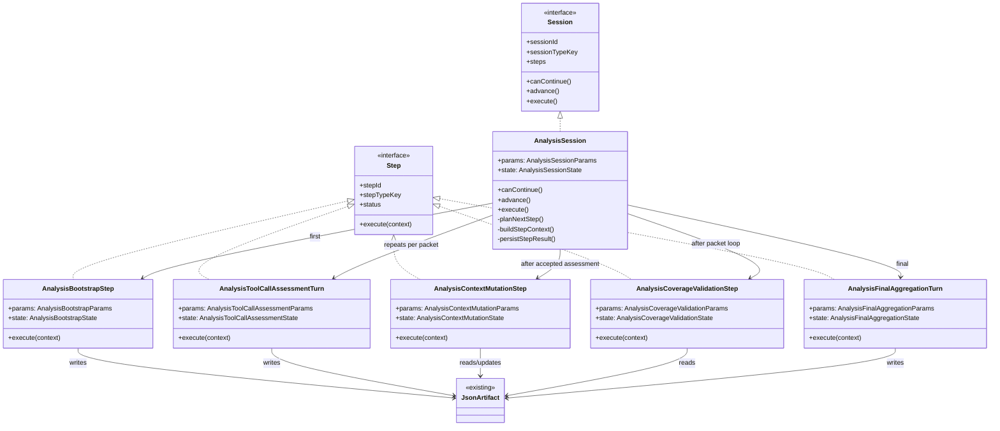

# Session analysis agent v2

This task defines the next real version of the session-analysis agent.

It is a standalone specification task. It intentionally consolidates the useful conclusions from earlier analysis-agent, evidence-protocol, hybrid-workflow, and backend-owned-launch notes into one active planning target.

This task should be treated as the current source of truth for the next analysis-agent direction.

## Handoff reading order

For coding handoff, read this document in the following order:

1. `Goal`, `Problem`, `Desired product outcome`, `Core decisions`, and `Scope`
2. `Exact session-analysis execution`, `Exact LLM-turn requirements`, `Exact context policy`, `Input contract`, and `Artifact contract`
3. `Backend-owned launch and lifecycle requirements`, `Validation expectations`, `Step-by-step implementation plan`, `Locked implementation defaults`, and `Locked implementation choices`

The following sections are supporting material rather than the primary contract:

- `Architecture cross-check`
- `Illustrative example: analysis of session CXQJ`

## Goal

Build a proper new version of the session-analysis agent that replaces the current one-shot prompt flow with a session-backed hybrid workflow in which:

- tool calls are the primary analysis unit
- deterministic steps control workflow shape, evidence selection, validation, and context mutation
- bounded LLM turns perform only narrow judgment tasks
- structured outputs are persisted as strict JSON artifacts
- the whole workflow remains inspectable through the normal mcpscope session model

The near-term product goal is a much more trustworthy per-session analysis primitive.

The architectural goal is to prove that mcpscope's new execution model can support deterministic steps combined with LLM turns inside one visible, inspectable analysis session.

The concrete workflow goal for this version is simple:

- analyze each tool call in the target turn individually
- persist one short structured assessment per tool call
- aggregate those assessments into one grounded final analysis of the turn

## Problem

The current analysis MVP proves that mcpscope can create an analysis child session and get an answer, but it is still too weak and too unconstrained to trust as a real debugging and evaluation tool.

Observed failure modes from earlier work:

- the model inspects too little before judging
- it often synthesizes conclusions from a root-level summary instead of the actual evidence-bearing parts
- it can overclaim what it inspected
- it mixes evidence extraction, request-success judgment, and MCP-surface diagnosis in one free-form pass
- smaller or lazier models degrade badly when left to self-manage the workflow

This is a product problem, not just a prompt problem.

The next agent version therefore needs explicit workflow structure, explicit working artifacts, and deterministic control over what the model sees and when.

## Desired product outcome

After this task, mcpscope should have a new analysis-agent workflow with the following user-facing properties:

- the user launches analysis on a finished parent session and explicitly chooses the target turn to analyze
- mcpscope creates a `session_analysis` child session as the visible runtime for the analysis
- the analysis session executes a deterministic multi-step workflow rather than a single free-form analysis prompt
- each LLM stage returns schema-valid JSON only
- each stage artifact remains inspectable after the run
- the final report is grounded in earlier structured artifacts rather than a vague end-of-run impression

More specifically, the user should be able to inspect for each tool call:

- why the model made the call
- what the model appeared to expect before making it
- what factually happened when the call ran
- what guidance or suggestion the result provided, if any
- how well the model used that result afterward

This task is still product-specific. It is not a generic agent framework.

## Core decisions for this version

These decisions are in scope for this task and should be treated as fixed unless implementation work reveals a concrete blocker.

### 1. Session-backed hybrid workflow

The analysis agent remains a child session, not a hidden background job and not a separate external workflow runtime.

The session is the inspectable execution container.

The harness owns step sequencing.

### 2. Deterministic outer control

The workflow is controlled by deterministic `Step` types around ordinary LLM `Turn` steps.

The model does not choose the stage order, packet order, or compaction policy in this version.

### 3. One explicit starting turn and a resumable parent-session frontier

Version 2 should start from one explicit finished turn inside one parent session.

Do not attempt open-ended autonomous planning across the whole session in this increment.

However, the analysis session should be allowed to continue later if the parent session gains additional completed turns.

The intended lifecycle is:

- the user launches analysis with one explicit starting turn
- the analysis session processes from its current frontier up to the latest completed turn currently available in the parent session
- when it reaches that end frontier, it emits a fresh final report and stops cleanly
- if the parent session later gains more completed turns, the same analysis session may resume and extend its analysis from the last analyzed frontier
- each completion pass may emit a new final report artifact; earlier reports remain historical, while the newest report is the current snapshot

Within each analyzed turn, tool calls are still the main unit of analysis.

### 4. JSON artifacts as working memory

Structured workflow state should live in `JsonArtifact` instances plus session working state.

Artifact subclasses remain content-oriented. Semantic meaning lives in schema keys and workflow validation rules, not in a new subclass for every artifact meaning.

### 5. Deterministic context mutation

After each bounded LLM assessment turn, bulky evidence should be removed from active visible context and replaced by accepted structured artifacts.

Stripped evidence must remain inspectable through normal history and lookup flows.

### 6. Backend-owned launch and orchestration

This version should not keep the current split ownership where the frontend launches only part of the workflow.

The backend should own child-session creation, initialization, stage sequencing, and failure handling.

## Scope

### In scope

- a new version of the `session_analysis` workflow
- backend-owned launch of that workflow
- one explicit starting turn plus resumable analyzed-through frontier
- per-tool-call assessment across each analyzed turn
- deterministic outer workflow using non-`Turn` steps
- bounded LLM turns with strict JSON output schemas
- persisted `JsonArtifact` stage outputs
- deterministic validation and context mutation between analysis turns
- a compact final findings artifact derived from earlier artifacts
- normal inspectability through session, step, artifact, transcript, and lookup surfaces
- enough backend/API support that CLI and MCP can later trigger the same workflow without semantic drift

### Out of scope

- multi-session or benchmark synthesis
- open-ended autonomous planning by the analysis model
- a generic public workflow engine for arbitrary tasks
- a new analysis viewer UI
- final benchmark-domain product work
- a broad retry/optimizer loop for analysis quality

## Standalone constraints

This task should not depend on fine-grained sequencing with older backlog tasks.

It can cite canonical docs for runtime and testing rules, but it should otherwise stand on its own.

Useful background from earlier candidate tasks should be treated as inputs that informed this task, not as blocking prerequisites.

## Workflow

The minimum workflow for this version is the following exact tool-call-centric structure.

## Exact session-analysis execution

The analysis session should execute as a deterministic sequence with bounded LLM turns inserted at specific points.

Execution order:

1. bootstrap the analysis run from one finished starting turn
2. determine the current completed-turn frontier in the parent session
3. prepare an ordered packet list containing every tool call across the not-yet-analyzed completed turns in that frontier
4. for each packet, run one bounded tool-call assessment turn
5. after each accepted assessment, deterministically compact active context to keep only durable analysis memory
6. when the current completed frontier has been fully assessed, run one final aggregation turn over the accepted assessments plus the relevant final answers

There is no free-form exploratory phase in this version.

There is no stage where the model decides what to inspect next.

The harness decides the full sequence.

### Stage 1. Bootstrap and packet preparation

Step type:

- deterministic artifact-production step

Responsibilities:

- validate the parent session and starting turn exist and are complete
- determine the current completed-turn frontier in the parent session
- gather session setup and analyzed-turn structure for all turns from the stored frontier start through the current completed frontier
- identify the user request, rounds, tool calls, and final answer parts for each newly covered turn
- build one deterministic packet per tool call across the newly covered turns
- create the initial artifact set for the rest of the workflow

No model judgment is allowed in this stage.

### Stage 2. Repeated bounded tool-call assessment turns

Step types:

- one bounded LLM `Turn` per packet
- one deterministic context-mutation step after each accepted packet assessment

For this version, packet kind is limited to `tool_call` packets.

Each packet-assessment turn should receive only the evidence needed for one tool-call decision slice and nothing more.

Required packet contents:

- the target turn's user request
- minimal run framing from `analysis_target`
- the specific round ID and tool-call part ID being assessed
- reasoning immediately before the tool call when present
- the tool call payload
- the tool result payload
- the next reasoning step after the result when present

The purpose of this turn is exact and fixed. For one tool call, the model must answer:

1. why was this tool call made?
2. what did the model appear to expect before making it?
3. what factually happened when the tool call ran?
4. what suggestion, guidance, or constraint did the tool result provide?
5. how well did the model exploit that result afterward?

The model should answer only the narrow packet questions and return exactly one JSON object matching the packet schema.

The output must stay short, factual, and tied to inspected evidence IDs.

### Stage 3. Coverage validation gate

Step type:

- deterministic validation step

Responsibilities:

- verify every required packet has an accepted assessment artifact
- verify final-answer evidence for the target turn is available
- stop the workflow with an inspectable failure state if required coverage is incomplete

This gate exists to prevent final aggregation from running on partial evidence.

### Stage 4. Final aggregation turn

Step type:

- bounded LLM `Turn`

Responsibilities:

- aggregate the accepted per-tool-call assessments
- evaluate whether the target request was answered, partially answered, unsupported, or unanswered
- determine the main MCP-surface issue or strength visible across the tool-call sequence
- identify the most actionable next improvement
- rely only on earlier artifacts plus the inspected target request and final answer

There is no separate broad free-form synthesis pass after this. This aggregation turn is the final analysis turn.

## Exact LLM-turn requirements

### Tool-call assessment turn

Each tool-call assessment turn must include these elements in prompt context:

- target session ID and target turn ID
- the target turn's user request text and part ID
- the packet's round ID
- the packet's tool-call part ID
- reasoning immediately before the tool call when present
- the tool-call request payload
- the tool-call result payload
- the next reasoning step when present
- a short instruction block telling the model to answer only for this one tool call

Each tool-call assessment turn must not include:

- raw evidence for earlier tool-call packets
- broad whole-session summaries beyond the stable framing artifact
- the model's own previous prose analysis outside accepted structured artifacts

### Final aggregation turn

The final aggregation turn must include these elements in prompt context:

- `analysis_target`
- all accepted `tool_call_assessment` artifacts for the target turn
- the target turn final answer text and part ID when present
- the target turn user request text and part ID

The final aggregation turn must not include:

- raw tool-call payloads from earlier packets once they have been compacted out
- fresh broad session inspection material
- any unconstrained invitation to re-analyze the whole session from scratch

## Exact context policy

### What is kept in active visible context throughout the run

- `analysis_target`
- `coverage_map`
- the currently active packet evidence during one tool-call assessment turn
- all accepted `tool_call_assessment` artifacts from earlier packets

### What is removed from active visible context after each tool-call assessment

- the raw reasoning-before content for that packet
- the raw tool-call payload and result for that packet
- the raw next-reasoning content for that packet

### What remains inspectable but no longer active

- all stripped packet evidence parts through transcript/history/lookup
- all raw turn content that was used to construct packets

The intended working memory is therefore:

- stable run framing
- packet coverage state
- accepted per-tool-call assessments

not a cumulative replay of raw evidence.

## Required step types

This task should introduce only the minimum new deterministic step types needed for the workflow.

Required new concrete step types:

- `AnalysisBootstrapStep`
- `AnalysisContextMutationStep`
- `AnalysisCoverageValidationStep`

The LLM work should continue to run through `Turn` with stronger prompt and schema control.

## Appendix A. Architecture cross-check

This section is a framework-fit check, not a second design.

It shows the minimum concrete runtime classes this task should add if it is implemented consistently with the current `Session.execute()` / `advance()` / `Step.execute()` model.

### High-level class diagram



### Intended framework fit

- one new concrete session class is sufficient: `AnalysisSession`
- no new `SessionContainer` type is needed because analysis already runs as a `session_analysis` child session
- deterministic workflow work should be represented by concrete `Step` implementations
- bounded LLM analysis stages should still execute as turn-like steps rather than inventing a second orchestration system
- no new artifact subclass hierarchy is needed; the workflow should continue to use `JsonArtifact` plus `schema_key`
- steps should be created lazily by `AnalysisSession.advance()` when they are ready to execute, not pre-created as a queued batch at launch time

### Pseudocode for `AnalysisSession.execute()` and `advance()`

```ts
class AnalysisSession implements Session {
  canContinue(): boolean {
    return this.state.phase !== 'complete' && this.state.phase !== 'error'
  }

  async execute(): Promise<void> {
    while (this.canContinue()) {
      await this.advance()
    }
  }

  async advance(): Promise<void> {
    const step = this.planNextStep()
    if (!step) {
      this.state.phase = 'complete'
      return
    }

    const context = this.buildStepContext(step)
    const result = await step.execute(context)
    await this.persistStepResult(step, result)

    if (result.status === 'error') {
      this.state.phase = 'error'
      return
    }

    this.state = reduceAnalysisState(this.state, step, result)
  }
}
```

High-level expectation for `planNextStep()`:

```ts
// Create the next step on demand from current session state.
// Do not pre-materialize the whole workflow at launch time.

if (!state.bootstrapComplete) {
  return new AnalysisBootstrapStep(...)
}

if (state.nextPacketIndex < state.packetCount) {
  if (state.awaitingContextMutation) {
    return new AnalysisContextMutationStep(...)
  }
  return new AnalysisToolCallAssessmentTurn(...)
}

if (!state.coverageValidated) {
  return new AnalysisCoverageValidationStep(...)
}

if (!state.finalAggregationComplete) {
  return new AnalysisFinalAggregationTurn(...)
}

return null
```

The important lifecycle rule is that `planNextStep()` should consult current persisted analysis state plus the current parent-session frontier each time `advance()` runs.

That allows the analysis session to stop after reaching the current end of the analyzed parent session and later resume when new completed turns appear.

### Pseudocode for new concrete step `execute()` methods

`AnalysisBootstrapStep.execute(context)`

```ts
validateTargetSessionAndTurn()
inspectTargetTurnStructure()
buildOrderedToolCallPackets()
writeArtifact('analysis_target')
writeArtifact('coverage_map')
writeArtifact('evidence_packet_index')
return complete(resultArtifacts)
```

`AnalysisToolCallAssessmentTurn.execute(context)`

```ts
loadCurrentPacketEvidence()
buildStrictPromptForOneToolCall()
runBoundedTurnWithSchema('analysis.tool_call_assessment.v1')
validateReturnedJson()
writeArtifact('tool_call_assessment')
return complete(resultArtifacts)
```

`AnalysisContextMutationStep.execute(context)`

```ts
confirmLatestAssessmentArtifactExists()
updateCoverageMapForAcceptedPacket()
removeRawPacketEvidenceFromActiveVisibleContext()
keepStableFramingAndAcceptedAssessmentsVisible()
persistUpdatedContextState()
return complete(updatedArtifacts)
```

`AnalysisCoverageValidationStep.execute(context)`

```ts
loadCoverageMap()
verifyEveryPacketHasAcceptedAssessment()
verifyFinalAnswerEvidenceState()
if (coverageIncomplete) failWithDiagnosticArtifact()
return complete([])
```

`AnalysisFinalAggregationTurn.execute(context)`

```ts
loadAcceptedToolCallAssessments()
loadTargetRequestAndFinalAnswerReference()
buildStrictAggregationPrompt()
runBoundedTurnWithSchema('analysis.final_analysis_report.v1')
validateReturnedJson()
writeArtifact('final_analysis_report')
return complete(resultArtifacts)
```

### Architecture conclusions from this cross-check

- the existing `Session` loop is sufficient for this workflow; no second workflow runner is needed
- the existing `Step.execute(context)` boundary is sufficient for both deterministic stages and bounded LLM stages
- the main runtime extension is step-type vocabulary plus analysis-session state shape, not a new persistence model
- the main thing to avoid is pushing orchestration decisions into prompts or frontend control flow

One implementation detail still needs to be handled deliberately, but it is not an architecture gap:

- analysis-specific bounded turns should continue to persist through the existing turn-oriented runtime path, while the new deterministic analysis stages use new concrete step types and generic step persistence

## Appendix B. Illustrative example: analysis of session `CXQJ`

This example is illustrative rather than normative.

Its purpose is to show what the analysis workflow would actually do on a real completed session.

Assumptions for this example:

- the parent session is `CXQJ`
- the analysis is launched after both currently existing turns are complete
- the analysis starts from turn `CXQJ.1`
- there are no newer completed turns beyond `CXQJ.2` at launch time

Observed parent-session structure at launch time:

- `CXQJ.1` asks for the days in the last 30 days where the outdoor sensor max temperature exceeded 20 C
- `CXQJ.1` contains four tool-call packets:
  - `CXQJ.1.1.3-T` `ha_history_list_entities`
  - `CXQJ.1.2.2-T` `ha_history_get_sensor_stats` with invalid `aggregation: ["max"]`
  - `CXQJ.1.3.2-T` repeated `ha_history_get_sensor_stats` with the same invalid `aggregation: ["max"]`
  - `CXQJ.1.4.2-T` successful `ha_history_get_sensor_stats` with `aggregation: "max"`
- `CXQJ.1.5.2-A` is the final answer listing 11 matching days
- `CXQJ.2` asks for a min/max table for those days
- `CXQJ.2` contains one tool-call packet:
  - `CXQJ.2.1.3-T` successful `ha_history_get_sensor_stats` with `aggregations: ["min", "max"]`
- `CXQJ.2.2.1-A` is the final answer presenting the table

### Example flow chart

```mermaid
flowchart TD
    A[Launch analysis for parent session CXQJ<br/>starting turn = CXQJ.1] --> B[AnalysisBootstrapStep]
    B --> C[Inspect parent session and determine completed frontier<br/>current frontier = CXQJ.2]
    C --> D[Create analysis_target artifact<br/>start_turn_id = CXQJ.1<br/>analyzed_through_turn_id = CXQJ.2]
    D --> E[Create evidence_packet_index with 5 packets]
    E --> P1[Packet 1<br/>CXQJ.1.1.3-T<br/>list_entities]
    P1 --> M1[LLM assessment turn<br/>why entity discovery was needed<br/>whether result gave a usable entity id]
    M1 --> CM1[Context mutation<br/>keep assessment artifact<br/>drop raw packet from active context]
    CM1 --> P2[Packet 2<br/>CXQJ.1.2.2-T<br/>get_sensor_stats invalid aggregation array]
    P2 --> M2[LLM assessment turn<br/>identify malformed parameter use<br/>note tool feedback was explicit]
    M2 --> CM2[Context mutation]
    CM2 --> P3[Packet 3<br/>CXQJ.1.3.2-T<br/>same invalid call repeated]
    P3 --> M3[LLM assessment turn<br/>assess repeated failure and poor exploitation of prior result]
    M3 --> CM3[Context mutation]
    CM3 --> P4[Packet 4<br/>CXQJ.1.4.2-T<br/>successful max-per-day query with filter > 20]
    P4 --> M4[LLM assessment turn<br/>assess successful recovery and whether result answered turn 1]
    M4 --> CM4[Context mutation]
    CM4 --> P5[Packet 5<br/>CXQJ.2.1.3-T<br/>successful min/max-per-day query]
    P5 --> M5[LLM assessment turn<br/>assess whether call matched follow-up request and how prior turn context was used]
    M5 --> CM5[Context mutation]
    CM5 --> V[Coverage validation step]
    V --> F[Final aggregation turn]
    F --> R[Write final_analysis_report artifact<br/>current snapshot through CXQJ.2]
    R --> S[Analysis session stops at current completed frontier]
    S --> T{Parent session later gets new completed turns?}
    T -- No --> U[Remain stopped with latest report]
    T -- Yes --> W[Resume same analysis session<br/>bootstrap only newly covered turns<br/>emit newer final report]
```



### Example step-by-step behavior

1. `AnalysisBootstrapStep` loads `CXQJ` and confirms that turns `CXQJ.1` and `CXQJ.2` are complete.
2. It determines that the current completed frontier is `CXQJ.2`.
3. It creates `analysis_target` with `start_turn_id = CXQJ.1` and `analyzed_through_turn_id = CXQJ.2`.
4. It creates `evidence_packet_index` with five ordered packets, one per tool call.
5. The first bounded assessment turn analyzes `CXQJ.1.1.3-T` and should conclude that the model used the discovery tool to find the exact temperature entity before querying stats.
6. The second bounded assessment turn analyzes `CXQJ.1.2.2-T` and should record that the model expected a stats query but used an invalid aggregation shape, while the tool result gave an explicit correction hint.
7. The third bounded assessment turn analyzes `CXQJ.1.3.2-T` separately, not merged with the prior failure, because v1 uses one packet per tool call. This packet should likely be assessed as a poor exploitation of the previous error message because the same malformed call was repeated.
8. The fourth bounded assessment turn analyzes `CXQJ.1.4.2-T` and should record that the model corrected the aggregation shape, successfully retrieved the matching days, and then used that result to answer turn 1.
9. The fifth bounded assessment turn analyzes `CXQJ.2.1.3-T` and should record that the model requested min/max-per-day data for the same sensor, received the full daily table, and then used it to answer the follow-up request.
10. After each accepted assessment, `AnalysisContextMutationStep` removes the raw packet evidence from active visible context and keeps only stable framing, coverage state, and accepted assessment artifacts.
11. `AnalysisCoverageValidationStep` verifies that all five packets have accepted assessments and that the needed final-answer evidence exists for the analyzed turns.
12. `AnalysisFinalAggregationTurn` then produces a `final_analysis_report` covering the current parent-session frontier through `CXQJ.2`.
13. The analysis session stops because it has reached the latest completed turn currently available in the parent session.
14. If a later turn `CXQJ.3` is added and completed afterward, the same analysis session can resume from its stored frontier and extend the analysis with new packets from that new turn before writing a newer final report.

### What this example clarifies

- repeated failed tool calls are analyzed separately when they occur as separate tool-call parts
- the workflow does not need to pre-create steps for all five packets at launch; it creates each next step only when `advance()` is called
- the final report is a snapshot through the current analyzed frontier, not a one-time terminal artifact that prevents later extension
- resumed analysis should reuse existing accepted packet assessments and only add coverage for newly completed parent-session turns

### Example `tool_call_assessment` artifact

This is an illustrative example for packet `CXQJ.1.3.2-T`, the repeated invalid `ha_history_get_sensor_stats` call.

```json
{
  "packet_id": "CXQJ.1.3.2-T",
  "round_id": "CXQJ.1.3",
  "tool_call_part_id": "CXQJ.1.3.2-T",
  "tool_name": "ha_history_get_sensor_stats",
  "user_goal_in_round": "Retrieve the days in the last 30 days where the outdoor temperature max exceeded 20 C.",
  "why_this_call_was_made": "The model was trying to query daily max statistics for the temperature sensor after already identifying the relevant entity.",
  "model_expectation_before_call": "The model appeared to expect the tool to accept an aggregation specification selecting max-per-day results filtered to values above 20 C.",
  "observed_result": {
    "status": "failed",
    "summary": "The tool rejected the call because the aggregation shape was invalid.",
    "result_excerpt": "Invalid aggregation \"max\". Valid values: mean, min, max, median, count."
  },
  "result_guidance": "The tool result gave an explicit correction hint: aggregation should be one valid value such as max, not the malformed shape used in the call.",
  "expectation_match": "mismatch",
  "most_direct_cause": "wrong_parameters",
  "result_usage_quality": "poor",
  "result_usage_explanation": "This packet repeated the same malformed call pattern after a prior failure had already exposed the expected aggregation format, so the model did not exploit the earlier tool feedback well.",
  "evidence_ids": [
    "CXQJ.1.2.2-T",
    "CXQJ.1.3.2-T"
  ]
}
```

### Example `final_analysis_report` artifact

This is an illustrative example of the final report snapshot after analyzing the current completed frontier through `CXQJ.2`.

```json
{
  "target_turn_id": "CXQJ.2",
  "outcome": "answered",
  "supported_by_evidence": true,
  "final_answer_part_id": "CXQJ.2.2.1-A",
  "turn_outcome_reason": "The parent session successfully answered both completed turns. Turn 1 eventually produced the requested list of days over 20 C after correcting an earlier tool-parameter mistake, and turn 2 successfully used a min/max daily stats query to produce the requested table.",
  "path_efficiency": "mixed",
  "primary_issue": "wrong_parameters",
  "actionable_next_improvement": "Improve parameter-shape guidance for stats aggregations so the model does not repeat a malformed aggregation call after the tool has already returned an explicit correction hint.",
  "supporting_artifact_ids": [
    "analysis.tool_call_assessment.CXQJ.1.1.3-T",
    "analysis.tool_call_assessment.CXQJ.1.2.2-T",
    "analysis.tool_call_assessment.CXQJ.1.3.2-T",
    "analysis.tool_call_assessment.CXQJ.1.4.2-T",
    "analysis.tool_call_assessment.CXQJ.2.1.3-T"
  ],
  "supporting_part_ids": [
    "CXQJ.1.5.2-A",
    "CXQJ.2.2.1-A"
  ]
}
```

## Input contract

The workflow should require explicit run inputs with this shape:

```json
{
  "target_session_id": "LS8K",
  "target_turn_id": "LS8K.3",
  "analysis_goal": "Diagnose whether the turn answered the request and whether MCP tool design contributed to failure.",
  "analysis_profile_key": "default"
}
```

Rules:

- `target_turn_id` is the required starting turn in this version
- the starting turn must already be complete
- the backend should reject invalid or still-running targets before creating a half-started workflow
- later resumed execution may extend beyond that starting turn if the parent session has gained additional completed turns

## Artifact contract

All workflow outputs should be persisted as `JsonArtifact` instances with explicit `schema_key` metadata.

Recommended metadata shape:

```json
{
  "schema_key": "analysis.tool_call_assessment.v1",
  "session_id": "PJF6",
  "target_session_id": "LS8K",
  "start_turn_id": "LS8K.3"
}
```

This task should standardize the following semantic artifact schemas.

### 1. `analysis_target`

Schema key:

- `analysis.analysis_target.v1`

Purpose:

- stable run-level framing shared across later stages

Required fields:

- `target_session_id`
- `start_turn_id`
- `analyzed_through_turn_id`
- `analysis_goal`
- analyzed-turn references and request/final-answer references needed by later stages
- `setup_part_ids`
- analyzed turn IDs
- round IDs
- `tool_call_part_ids`

The exact field names for per-turn reference arrays can be finalized in implementation, but the contract must preserve a stable starting turn and a moving analyzed-through frontier.

### 2. `coverage_map`

Schema key:

- `analysis.coverage_map.v1`

Purpose:

- machine-checkable state of what required evidence has been inspected and assessed

Required fields:

- setup required and inspected part IDs
- target-turn required and inspected round IDs
- final-answer coverage state
- packet coverage state including linked assessment artifacts

### 3. `evidence_packet_index`

Schema key:

- `analysis.evidence_packet_index.v1`

Purpose:

- deterministic ordered packet worklist for the packet-assessment stage

Required fields:

- `packet_kind`
- ordered packet list
- round ID per packet
- tool-call part ID per packet
- reasoning-before and reasoning-after part IDs when present
- one stable packet ordering field so the harness never guesses execution order

### 4. `tool_call_assessment`

Schema key:

- `analysis.tool_call_assessment.v1`

Purpose:

- narrow factual assessment of one tool-call packet

Required fields:

- `packet_id`
- `round_id`
- `tool_call_part_id`
- `tool_name`
- `user_goal_in_round`
- `why_this_call_was_made`
- `model_expectation_before_call`
- `observed_result`
- `result_guidance`
- `expectation_match`
- `most_direct_cause`
- `result_usage_quality`
- `result_usage_explanation`
- `evidence_ids`

Required enum constraints:

- `observed_result.status`: `success`, `failed`, `mixed`
- `expectation_match`: `match`, `partial_match`, `mismatch`, `unclear`
- `most_direct_cause`: `wrong_parameters`, `tool_misunderstanding`, `tool_description_clarity`, `tool_surface_mismatch`, `tool_limitation`, `unclear`
- `result_usage_quality`: `good`, `partial`, `poor`, `not_applicable`, `unclear`

### 5. `final_analysis_report`

Schema key:

- `analysis.final_analysis_report.v1`

Purpose:

- final grounded aggregation over the per-tool-call assessments and target-turn outcome

Required fields:

- `target_turn_id`
- `outcome`
- `supported_by_evidence`
- `final_answer_part_id`
- `turn_outcome_reason`
- `path_efficiency`
- `primary_issue`
- `actionable_next_improvement`
- `supporting_artifact_ids`
- `supporting_part_ids`

Required enum constraints:

- `outcome`: `answered`, `partially_answered`, `unsupported`, `unanswered`
- `primary_issue`: `tool_description_clarity`, `tool_surface_mismatch`, `tool_limitation`, `wrong_parameters`, `tool_misunderstanding`, `unclear`
- `path_efficiency`: `efficient`, `mixed`, `inefficient`

This final report replaces the earlier split between separate outcome and findings artifacts.

## Prompt and output rules for all LLM stages

Every LLM stage in this task must follow these rules:

- the prompt defines one task only
- the prompt provides the exact JSON schema expected
- the model must return only the JSON object and no surrounding prose
- the model must rely only on the provided evidence and cited artifacts
- malformed JSON or schema-invalid output is a workflow failure for that step

This task should prefer hard contracts over best-effort natural-language formatting.

## Deterministic context-mutation rules

After each accepted packet assessment:

- remove the raw packet evidence payload from active visible context
- keep the accepted `tool_call_assessment` artifact in active visible context
- keep stable run framing artifacts such as `analysis_target` and `coverage_map` available
- keep stripped evidence recoverable through normal transcript and lookup inspection

The intended working memory is the accepted artifact ledger, not a growing pile of repeated raw evidence.

## Backend-owned launch and lifecycle requirements

This task should replace the current split launch behavior with one backend-owned execution path.

Required behavior:

- create the `session_analysis` child session
- initialize it against the restricted analysis MCP surface when needed
- start the first workflow step without frontend-owned orchestration gaps
- avoid leaving a partially launched child session because the caller failed mid-flow
- keep failure states inspectable if the workflow stops after the child session exists
- resume the same analysis session later instead of requiring a brand-new child session when the parent session has gained more completed turns
- stop cleanly with a fresh final report when the analysis frontier catches up with the currently completed parent-session frontier
- allow later re-entry to produce a newer final report snapshot without invalidating the historical earlier reports

The UI should become a thin caller of the same backend-owned launch path.

The design should also leave room for later CLI and MCP triggers to call the same backend-owned workflow without semantic drift.

## Acceptance criteria

This task is ready for implementation splitting when all of the following are true:

1. the task fully defines the new analysis-agent behavior as one coherent product increment
2. the workflow shape is explicit and bounded
3. the minimum new deterministic step types are identified
4. the artifact contract is explicit and schema-oriented
5. the backend-owned launch behavior is part of the task rather than a separate guessed follow-up
6. the task is inspectability-first and consistent with the session-backed execution model
7. the task is clear enough to hand to one coding-agent implementation branch without reopening workflow design

## Validation expectations

Implementation of this task should be validated against known bad analysis cases that previously produced lazy inspection or unsupported synthesis.

Validation should prove:

- required packet coverage actually happened
- final claims are traceable to structured artifacts and inspected evidence
- the workflow is more grounded than the current one-shot analysis baseline
- deterministic context mutation keeps active context under control without hiding prior evidence from inspection
- step creation happens on demand from current session state rather than from a pre-created static step queue
- when the parent session grows later, the analysis session can resume from its stored analyzed-through frontier and emit a newer final report

This task should be implemented as one coherent coding-agent task, even if the coding agent chooses to land the work through several internal branch commits.

## Step-by-step implementation plan

The implementation should proceed in the order below.

Each step is intended to leave the branch in a coherent, testable state before the next step starts.

The coding agent should treat the gates as hard review points. If a gate fails, the branch should not widen scope until the issue is resolved or escalated back to planning.

### Step 1. Lock the workflow contract in code-friendly shapes

Goal:

- make the active specification executable by defining the final backend-owned contract for workflow inputs, stage outputs, and step sequencing boundaries

Work:

- define the concrete TypeScript shapes or Zod schemas for:
  - workflow input contract
  - `analysis_target`
  - `coverage_map`
  - `evidence_packet_index`
  - `tool_call_assessment`
  - `final_analysis_report`
- define the packet representation used internally by the bootstrap stage
- define the exact sequence of step kinds and their state transitions
- define the persisted analysis frontier state used to resume when the parent session gains more completed turns
- define the exact malformed-output behavior for bounded LLM turns
- decide where schema validation lives for each artifact write

Expected result:

- the implementation branch has one unambiguous contract for artifacts and step sequencing
- later code does not need to infer missing field names or enums from prose

Gate before Step 2:

- all required schemas are explicit and internally consistent
- no remaining ambiguity about required artifact fields or enum values
- artifact metadata shape is fixed enough to persist and inspect

### Step 2. Add analysis-v2 step and state vocabulary to the runtime

Goal:

- introduce the minimum runtime vocabulary needed for analysis v2 without yet wiring the full workflow end to end

Work:

- add the new deterministic step types:
  - `AnalysisBootstrapStep`
  - `AnalysisContextMutationStep`
  - `AnalysisCoverageValidationStep`
- define how analysis-specific step state is represented in generic step persistence
- define how the session distinguishes this workflow from the current one-shot analysis behavior
- ensure `Turn` can carry strict output-schema requirements for bounded analysis turns

Expected result:

- the runtime can represent the full planned workflow shape even if the stages are still stubbed

Gate before Step 3:

- the new step vocabulary fits the existing `Session` / `Step` model cleanly
- no new workflow-specific persistence tables are being introduced unnecessarily
- the bounded-turn output-schema hook is clear enough for later implementation

### Step 3. Implement artifact persistence and validation for analysis-v2 outputs

Goal:

- make JSON artifacts the authoritative working memory for the workflow

Work:

- implement the write/read path for the required analysis artifacts using `JsonArtifact`
- enforce `schema_key` metadata conventions
- add validation on artifact creation for each required schema
- decide how artifact lookup is exposed to later steps and inspection surfaces
- ensure the persisted artifacts remain inspectable through normal session-related tooling

Expected result:

- the runtime can store and reload the analysis ledger without depending on transcript re-parsing

Gate before Step 4:

- artifact writes and reads are deterministic and schema-validated
- the working state needed by later stages can be reconstructed from persisted artifacts and session state
- inspection surfaces can expose artifacts without inventing adapter-only semantics

### Step 4. Implement bootstrap and packet preparation

Goal:

- make the harness deterministically prepare the analysis worklist for one finished target turn

Work:

- validate the parent session and target turn
- reject incomplete or invalid starting targets before partial workflow startup
- inspect the parent setup and the currently analyzable turn range
- extract the request, final answer, rounds, and tool-call sequence for newly covered turns
- create `analysis_target`, `coverage_map`, and `evidence_packet_index`
- define the initial session working state for the run

Expected result:

- analysis v2 can start or resume from a stable, explicit worklist instead of an improvised prompt

Gate before Step 5:

- bootstrap artifacts are correct for known sample sessions
- packet ordering is deterministic
- invalid targets fail fast before a half-started workflow is left behind
- resumed execution picks up from the stored analyzed-through frontier rather than rebuilding already accepted coverage

### Step 5. Implement bounded packet-assessment turns

Goal:

- make one bounded LLM turn assess exactly one tool-call packet and return one strict JSON object

Work:

- build the prompt/spec for one tool-call assessment turn
- provide exactly the packet evidence slice plus minimal stable framing
- enforce JSON-only output behavior
- validate the returned JSON against the `tool_call_assessment` schema
- persist accepted assessments as artifacts
- ensure malformed or invalid outputs fail the step visibly and inspectably

Expected result:

- packet assessment becomes a narrow, repeatable unit of analysis rather than free-form trace narration

Gate before Step 6:

- one packet can be assessed end to end on a deterministic test path
- accepted assessments are schema-valid and persisted
- invalid outputs fail predictably without corrupting later workflow state

### Step 6. Implement deterministic context mutation after packet assessment

Goal:

- replace bulky raw evidence in active visible context with accepted assessment artifacts while preserving inspectability of stripped history

Work:

- define the exact visible-context mutation performed after each accepted packet assessment
- keep `analysis_target`, `coverage_map`, and accepted packet assessments visible
- remove the raw packet evidence payload from active visible context
- preserve transcript and lookup recoverability for stripped evidence
- update packet coverage state in `coverage_map`

Expected result:

- the workflow's working memory becomes the accepted artifact ledger instead of a growing replay of raw evidence

Gate before Step 7:

- context mutation is deterministic and inspectable
- stripped evidence is no longer active context but is still retrievable through normal history/lookup paths
- token growth for repeated packet analysis is controlled by design rather than by prompt discipline alone

### Step 7. Implement coverage validation gate

Goal:

- prevent premature adjudication or synthesis when required packet coverage is incomplete

Work:

- verify every required packet has an accepted `tool_call_assessment`
- verify final-answer evidence for the target turn is available
- stop the workflow with an inspectable failure state when coverage is incomplete
- ensure downstream stages cannot run past a failed validation gate

Expected result:

- the workflow can no longer produce a final judgment after partial evidence collection

Gate before Step 8:

- incomplete coverage is rejected deterministically
- successful coverage allows adjudication to proceed cleanly

### Step 8. Implement the final aggregation turn

Goal:

- complete the workflow with one final bounded LLM stage that consumes the per-tool-call assessments and target-turn outcome evidence only

Work:

- implement the `final_analysis_report` turn and schema enforcement
- ensure the aggregation stage does not reread broad raw session evidence beyond the permitted inputs
- persist the final artifact and expose it to inspection

Expected result:

- the workflow ends with one grounded structured final report derived from the per-tool-call ledger

Gate before Step 9:

- the final report artifact is schema-valid
- final claims are traceable to earlier artifacts and cited evidence
- the final workflow is materially more grounded than the one-shot baseline on known bad cases

### Step 9. Replace split launch ownership with backend-owned orchestration

Goal:

- make the backend the owner of child-session creation, initialization, and workflow startup for analysis v2

Work:

- implement one backend-owned launch path for analysis v2
- create the child session and initialize it without frontend-owned orchestration gaps
- preserve inspectability when launch fails after child-session creation
- keep the UI as a thin caller of the backend-owned path
- shape the API so CLI and MCP can later trigger the same workflow semantics

Expected result:

- analysis v2 launch behavior aligns with the rest of the backend-owned execution model

Gate before Step 10:

- there is one backend-owned launch path
- partial-launch failure behavior is inspectable and deterministic
- frontend behavior no longer owns stage orchestration logic

### Step 10. Add focused validation and regression coverage

Goal:

- lock in the behavior with the repo's preferred regression strategy before broader rollout

Work:

- add focused backend tests for bootstrap, packet assessment validation, context mutation, coverage gating, and backend-owned launch failure behavior
- add replay-oriented regression coverage where workflow behavior spans persisted turns, artifacts, and orchestration
- add narrow tests for schema enforcement and failure handling on invalid LLM output
- run backend typecheck and deterministic tests for the touched surfaces

Expected result:

- the new workflow is protected by regression coverage appropriate to its orchestration complexity

Final gate before implementation handoff is considered complete:

- `npm test` passes for the touched branch state
- `npm run check:backend` passes
- the workflow is covered by focused runtime tests and replay-style validation where appropriate
- known bad analysis cases show improved grounding compared with the old baseline

## Important gates and stop conditions

The coding agent should stop and escalate back to planning instead of guessing if any of these happens:

- the current runtime cannot express strict per-turn output schemas without broader architectural change
- deterministic context mutation cannot be implemented without violating the canonical session/context model
- artifact persistence needs a new semantic subtype hierarchy rather than schema-keyed `JsonArtifact`s
- backend-owned launch turns out to require a materially different public API shape than assumed here
- packet construction for one target turn reveals that `tool_call` packets are not a stable enough unit for the first version

## Locked implementation defaults

The following points are no longer open design questions for this backlog item. They are the required defaults for the coding handoff unless implementation uncovers a concrete architectural blocker.

### Default 1. Exact output-schema enforcement mechanism for `Turn`

Strict JSON-only output is enforced by backend-side parsing and schema validation.

Required behavior:

- every bounded analysis turn returns machine-readable text that is parsed by the backend
- the backend validates the parsed object against the expected schema before artifact persistence
- schema-invalid output fails the step immediately and visibly
- model-provider schema features may be used when available, but only as guidance rather than as the trust boundary

### Default 2. Artifact discoverability surface

Analysis artifacts must remain inspectable through the existing session-oriented inspect and lookup surfaces.

Required behavior:

- prefer extending current session lookup and trace inspection paths
- do not introduce a separate artifact-only API surface in this version unless an existing surface proves technically insufficient
- artifact IDs and schema keys must be visible enough for downstream inspection and replay-oriented tests

### Default 3. Session working state versus artifact contents

Durable analysis facts live in artifacts. Session and step state hold only orchestration cursor state.

Required behavior:

- `analysis_target`, `coverage_map`, per-packet assessments, final reports, and machine-readable diagnostics are persisted as artifacts
- active packet index, stage cursor, retry-free progression state, and similar workflow bookkeeping stay in session or step state
- later stages must be able to reconstruct durable analysis meaning from artifacts plus minimal orchestration state

### Default 4. Final answer handling when absent or ambiguous

The target turn final answer is nullable.

Required behavior:

- `analysis_target` must allow missing final-answer references
- the final aggregation turn must explicitly handle turns with no normal final answer
- absence of a final answer is evidence and must not be silently normalized into a synthetic answer part

### Default 5. Packet definition boundaries

In v1, one packet is exactly one tool call.

Required behavior:

- retries remain separate packets even when they target the same tool
- the packet ledger preserves chronological order exactly as seen in the target turn
- clustered or merged packet types are out of scope for this version

### Default 6. Failure-state representation inside analysis sessions

Inspectable workflow failure is represented by explicit step or session status plus a structured diagnostic artifact.

Required behavior:

- do not rely only on free-form transcript parts to represent workflow failure
- diagnostic artifacts should capture the failing stage, failure kind, and the relevant evidence or validation reason
- failed runs must remain inspectable through the normal session surfaces

## Locked implementation choices

The coding agent should treat the following as the implementation target rather than as branch-local policy choices.

### Choice 1. Where the analysis-v2 launch operation lives

Shared analysis-v2 launch semantics belong in [backend/src/operations](backend/src/operations).

The backend operation layer is the source of truth for HTTP, CLI, and MCP convergence.

### Choice 2. Whether analysis-v2 coexists with or replaces the current analysis route

The branch should replace the current analysis launch semantics rather than maintaining long-lived dual behavior.

Temporary compatibility wiring is acceptable only if required to land safely, but the target state of this task is one analysis path with v2 semantics.

### Choice 3. How strict malformed JSON handling should be

Malformed or schema-invalid JSON fails the bounded turn immediately.

This version must not silently salvage partial JSON, apply heuristic repair, or continue on best effort.

### Choice 4. Whether `analysis_goal` is user-authored, profile-authored, or both

`analysis_goal` supports both explicit user-authored goal text and profile-authored defaults.

Required behavior:

- keep user-supplied goal text separate from profile-derived instructions
- persist both in stable framing artifacts when both are present
- do not flatten them into one opaque prompt string in the durable contract

### Choice 5. Whether bounded LLM turns should use MCP tools directly

Bounded tool-call assessment turns are tool-free by default.

Required behavior:

- deterministic bootstrap and controlled inspection steps should gather the evidence needed for analysis turns
- analysis turns should not re-open broad MCP exploration on their own
- any exception to this rule should be treated as an implementation blocker requiring escalation rather than an ad hoc extension

## Notes for later splitting

The coding agent may still implement this task incrementally inside one branch, but this backlog item should remain one coherent task and one coherent handoff.